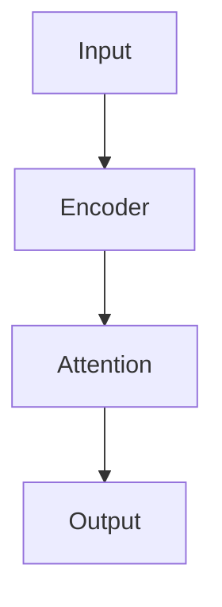

# Blog Post Authoring Guide

Reference for every formatting option available in MDX posts. All custom components are auto-imported — no import statements needed.

---

## Frontmatter

Every post starts with a YAML frontmatter block.

```yaml
---
title: "Your Post Title"
slug: "your-post-slug"          # used in the URL: /#/blog/your-post-slug
date: "Jan 10, 2025"            # displayed on card and post header
readTime: "~8 min read"
tags: ["Deep Learning", "LLM"]  # array — shows as accent badges
image: "/blog/your-slug/cover.png"  # cover image on the card (16:9 crop)
desc: "One-sentence teaser shown on the blog card and post header."
---
```

**Image path convention:** put post images in `public/blog/<slug>/`. Reference them as `/blog/<slug>/filename.png`.

---

## Standard Markdown

### Headings

Only use `##` (h2) and `###` (h3) inside posts — they auto-generate ToC entries.

```markdown
## Section Title       ← appears in "On this page" ToC
### Subsection         ← also appears in ToC, indented
```

### Inline formatting

```markdown
**bold text**
*italic text*
`inline code`
[link text](https://example.com)
```

### Paragraphs and lists

```markdown
Regular paragraph text. Just write prose.

- Unordered item one
- Unordered item two

1. Ordered item one
2. Ordered item two
```

### Blockquote

```markdown
> This renders as a styled quote block with a subtle background.
```

### Horizontal rule

```markdown
---
```

Renders as a thin separator line (`<div class="sep">`).

---

## Code Blocks

Syntax highlighting via Shiki. Supported languages: `python`, `bash`, `shell`, `javascript`, `typescript`, `jsx`, `tsx`, `json`, `yaml`, `toml`, `markdown`, `terraform`, `css`.

````markdown
```python
import torch
x = torch.randn(3, 4)
```
````

````markdown
```bash
pip install torch torchvision
python train.py --epochs 100
```
````

**Inline code:** wrap with backticks — `` `variable_name` ``.

---

## Math — KaTeX / LaTeX

### Inline math

Wrap with single `$`:

```markdown
The scaling factor is $\frac{1}{\sqrt{d_k}}$.
The loss is $\mathcal{L} = -\sum_i y_i \log \hat{y}_i$.
```

### Display math (block)

Wrap with `$$` on its own lines:

```markdown
$$
\text{Attention}(Q, K, V) = \text{softmax}\!\left(\frac{QK^\top}{\sqrt{d_k}}\right) V
$$
```

### Aligned multi-line equations

```markdown
$$
\begin{aligned}
z^{(1)} &= W^{(1)} x + b^{(1)} \\
a^{(1)} &= g\!\left(z^{(1)}\right) \\[6pt]
z^{(2)} &= W^{(2)} a^{(1)} + b^{(2)}
\end{aligned}
$$
```

### Piecewise / cases

```markdown
$$
f(x) = \begin{cases} x & x \geq 0 \\ 0 & x < 0 \end{cases}
$$
```

### Common symbols quick-ref

| Symbol | LaTeX |
|--------|-------|
| Fraction | `\frac{a}{b}` |
| Square root | `\sqrt{x}` |
| Superscript | `x^{n}` |
| Subscript | `x_{i}` |
| Sum | `\sum_{i=1}^{n}` |
| Product | `\prod_{i=1}^{n}` |
| Partial | `\partial` |
| Nabla | `\nabla` |
| Approx | `\approx` |
| In | `\in` |
| Infinity | `\infty` |
| Bold vector | `\mathbf{x}` |
| Hat | `\hat{y}` |
| Bar | `\bar{x}` |
| Tilde | `\tilde{x}` |
| Matrix transpose | `W^\top` |
| Expected value | `\mathbb{E}` |
| Real numbers | `\mathbb{R}` |
| Normal dist | `\mathcal{N}(\mu, \sigma^2)` |
| Text in math | `\text{softmax}` |

---

## Mermaid Diagrams

````markdown

````

Other diagram types: `graph LR`, `sequenceDiagram`, `classDiagram`, `erDiagram`.

---

## Tables

Standard GFM table syntax:

```markdown
| Property | Value A | Value B |
|----------|---------|---------|
| Speed    | Slow    | Fast    |
| Memory   | O(1)    | O(n²)   |
```

---

## Images

Standard markdown image — renders with caption if alt text is provided:

```markdown

```

---

## Custom Components

All components below are globally available — no import needed.

---

### `<Callout>`

Highlighted info/insight box. `label` is optional.

```mdx
<Callout label="Key Insight">
Self-attention lets every position attend to every other position simultaneously.
</Callout>

<Callout>
No label — just a highlighted note block.
</Callout>
```

---

### `<Figure>`

Image with optional caption and size control.

```mdx
<Figure
  src="/blog/slug/image.png"
  alt="Alt text"
  caption="Caption shown below the image."
  size="lg"
/>
```

**`size` options:** `sm` · `md` · `lg` · `xl` · `full` (default)

---

### `<TwoUp>`

Side-by-side image pair.

```mdx
<TwoUp
  left={{ src: "/blog/slug/before.png", alt: "Before", caption: "Before" }}
  right={{ src: "/blog/slug/after.png", alt: "After", caption: "After" }}
/>
```

---

### `<FormulaCard>`

Displays a named formula with KaTeX rendering and a description.

```mdx
<FormulaCard name="Cross-Entropy Loss" formula="\mathcal{L} = -\sum_i y_i \log \hat{y}_i">
The standard loss for classification. Penalizes confident wrong predictions heavily.
</FormulaCard>

<FormulaCard name="ReLU" formula="g(z) = \max(0,\, z)">
Zero for negative inputs, linear for positive. Most widely used activation today.
</FormulaCard>
```

The `formula` prop is a raw LaTeX string rendered in display mode.

---

### `<StepCard>`

Numbered step in a sequence. Wrap multiple in `<div className="space-y-3 mt-3">`.

```mdx
<div className="space-y-3 mt-3">

<StepCard n={1} title="Tokenize the input">
Split the sentence into tokens and map each to an integer ID using a vocabulary.
</StepCard>

<StepCard n={2} title="Embed the tokens">
Look up each token ID in the embedding matrix to get a dense vector representation.
</StepCard>

</div>
```

---

### `<InfoCard>`

General info box with optional title.

```mdx
<InfoCard title="Why this matters">
Without non-linearity, stacking layers achieves nothing — every composition of linear
functions is itself linear.
</InfoCard>
```

Wrap multiple in `<div className="space-y-5 mt-2">` for spacing.

---

### `<BulletCard>`

Bullet-point card. Use `danger={true}` for a red bullet (warnings/caveats).

```mdx
<BulletCard title="Parallelizable">
Unlike RNNs, attention computes all positions simultaneously — no sequential dependency.
</BulletCard>

<BulletCard title="Dead neurons" danger={true}>
ReLU neurons that always output zero stop learning. Use Leaky ReLU or careful initialization.
</BulletCard>
```

---

### `<CodeProof>`

Monospace math derivation with optional title and prose follow-up.

```mdx
<CodeProof
  title="Three-layer collapse without activation"
  code={`z³ = W³(W²(W¹x + b¹) + b²) + b³
   = W³W²W¹x + [W³W²b¹ + W³b² + b³]
   = W″x + b″   ← still linear`}
>
No matter how deep the stack, composition of linear functions stays linear.
</CodeProof>
```

---

### `<InlineMath>` / `<MathBlock>` (legacy)

Prefer `$...$` and `$$...$$` KaTeX syntax instead. These components still exist for backward compat but produce unstyled monospace output, not rendered LaTeX.

---

## Layout Helpers

These are plain JSX inside MDX — no import needed.

```mdx
<div className="space-y-3 mt-3">
  <!-- multiple cards stacked with gap -->
</div>

<div className="space-y-5 mt-2">
  <!-- larger gap variant -->
</div>
```

---

## Full Post Template

```mdx
---
title: "Post Title"
slug: "post-slug"
date: "Jan 1, 2025"
readTime: "~10 min read"
tags: ["Deep Learning", "Computer Vision"]
image: "/blog/post-slug/cover.png"
desc: "One sentence that appears on the blog card."
---

## Introduction

Opening paragraph — set up the problem or question.

<Callout label="What you'll learn">
Brief outline of what this post covers.
</Callout>

## The Math

The loss function is defined as:

$$
\mathcal{L} = -\frac{1}{N}\sum_{i=1}^{N} y_i \log \hat{y}_i
$$

Where $y_i$ is the true label and $\hat{y}_i$ is the predicted probability.

## Implementation

```python
import torch
import torch.nn.functional as F

def cross_entropy(logits, targets):
    return F.cross_entropy(logits, targets)
```

## Key Formulas

<div className="space-y-3 mt-3">

<FormulaCard name="Softmax" formula="\sigma(z)_i = \dfrac{e^{z_i}}{\sum_j e^{z_j}}">
Converts raw logits into a probability distribution. Output sums to 1.
</FormulaCard>

</div>

## Summary

- Key takeaway one
- Key takeaway two
- Key takeaway three

---

*Written by Vatsal Thakkar · University of Georgia*
```

---

## Checklist Before Publishing

- [ ] `slug` is URL-safe (lowercase, hyphens, no spaces)
- [ ] `image` path exists in `public/blog/<slug>/`
- [ ] `tags` is an array even if only one tag
- [ ] All `$$` blocks have blank lines above and below them
- [ ] No `<h1>` headings inside the post body (title comes from frontmatter)
- [ ] File is saved as `src/posts/<slug>.mdx`
