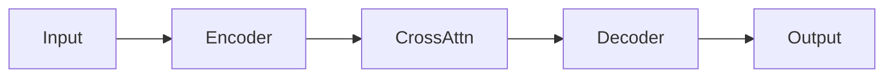

## Introduction

Write your intro here. Standard Markdown works — **bold**, *italic*, `inline code`, [links](https://example.com).

## Python

```python
import torch
import torch.nn as nn

class Model(nn.Module):
    def __init__(self, dim: int):
        super().__init__()
        self.linear = nn.Linear(dim, dim)

    def forward(self, x: torch.Tensor) -> torch.Tensor:
        return self.linear(x)
```

## Shell / Bash

```bash
# Train the model
python train.py \
  --epochs 100 \
  --lr 1e-3 \
  --output ./checkpoints
```

```shell
pip install torch torchvision
export CUDA_VISIBLE_DEVICES=0
```

## Markdown

````markdown
## Section

**Bold text**, *italic*, `inline code`.

```python
print("nested code block")
```
````

## Terraform

```terraform
resource "aws_instance" "gpu_node" {
  ami           = "ami-0c55b159cbfafe1f0"
  instance_type = "p3.2xlarge"

  tags = {
    Name = "ml-training"
  }
}
```

## Mermaid



## Using the Callout Component

<Callout label="Key Insight">
You can use the Callout component without importing it — it's available in every MDX post.
</Callout>

## Summary

- Point one
- Point two
- Point three
