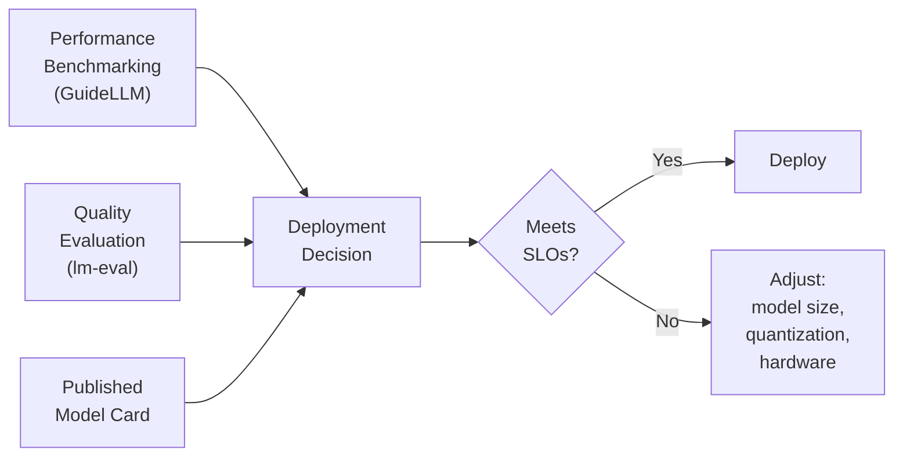
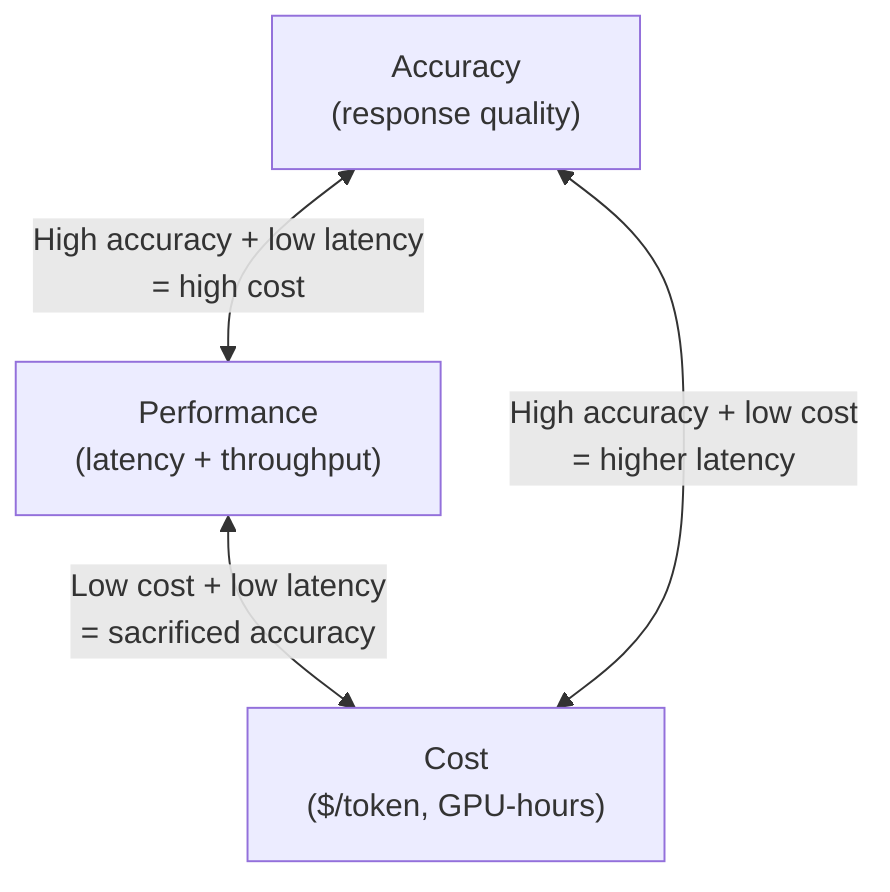
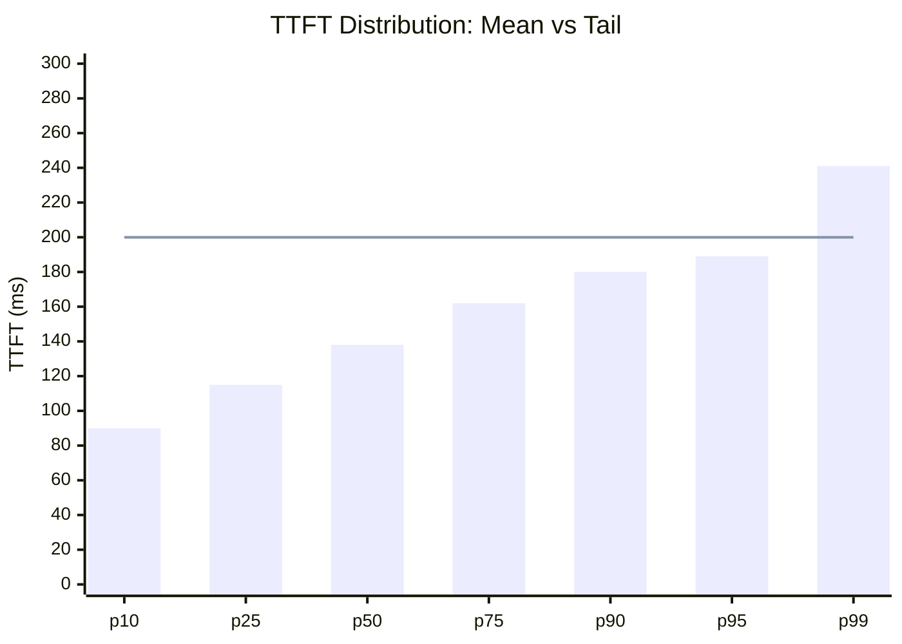
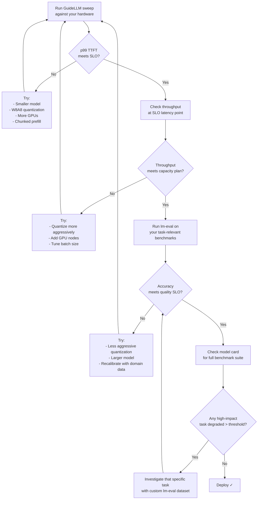

## You Optimized It. Now Prove It Works.

The previous posts covered how to compress a model and how to serve it efficiently. But optimization without measurement is just guessing. How do you know if the compressed model still gives good enough answers? How do you know if your vLLM server can handle peak traffic? How do you know *which* of two model sizes to deploy on your hardware?

The answer is measurement — two complementary kinds.



**Model benchmarking** is the standardized comparison of a model against predefined datasets or other models using objective metrics. **Model evaluation** is the broader question of whether the model is fit for your specific purpose across accuracy, safety, and task suitability. Benchmarking is one tool you use to answer the evaluation question.

---

## The Tradeoff Triangle

Every LLM deployment navigates three competing objectives:



In practice most deployments can optimize two corners at the expense of the third. The optimization techniques from the previous posts (quantization, continuous batching, PagedAttention) push the frontier — they give you more of all three — but they don't eliminate the tradeoffs. They change the slope.

**Without measurements, you can't even know where you are on this triangle** — let alone make a reasoned decision about where to land.

---

## Step Zero: Define SLOs Before You Benchmark

Benchmark numbers only mean something relative to your targets. The same p95 TTFT of 400ms is excellent for a document-processing pipeline and terrible for a customer-facing chat interface.

Before running a single benchmark, write down your SLOs:

| Use Case | TTFT (p99) | ITL (p99) | E2E Latency | Throughput |
|----------|-----------|-----------|-------------|------------|
| E-commerce chatbot | < 200ms | < 50ms | < 2s | > 50 req/s |
| RAG system (thoughtful answers) | < 300ms | < 100ms | < 3s | > 20 req/s |
| Code completion (IDE plugin) | < 100ms | < 30ms | < 1s | > 100 req/s |
| Document summarization (batch) | < 2s | < 200ms | < 30s | > 5 req/s |
| Offline data pipeline | N/A | N/A | < 60s | maximize |

<Callout label="SLOs are percentiles, not averages">
An SLO written as "TTFT under 200ms" must specify the percentile. "Mean TTFT under 200ms" means half your users wait longer. "p99 TTFT under 200ms" means 99 out of 100 requests meet it — which is a fundamentally different target. Always anchor SLOs to p95 or p99.
</Callout>

---

## When to Benchmark

Four scenarios where benchmarking is not optional:

<div className="space-y-3 mt-3">

<StepCard n={1} title="Pre-deployment model selection">
Before committing to a model, verify it can meet your SLOs on your hardware. An 8B model on one H100 may outperform a 70B model on four H100s for latency-sensitive workloads — but you need the numbers to know. Running a 30-minute benchmark before signing off on infrastructure saves weeks of production firefighting.
</StepCard>

<StepCard n={2} title="Capacity planning">
Throughput-per-server × your peak RPS target = number of servers needed. Benchmarking tells you the left side of that equation. Without it, you're guessing provisioning from first principles and will either over-provision (waste) or under-provision (outage).
</StepCard>

<StepCard n={3} title="Regression and A/B testing">
Every model change — quantization, version bump, config tweak — can shift performance in non-obvious directions. A quantized model might have 3× higher throughput but 8% worse latency at tail due to dequantization overhead. Benchmarking before and after every change catches regressions before users feel them.
</StepCard>

<StepCard n={4} title="Finding the hardware breaking point">
Every system has a load level where latency begins climbing sharply — the "knee" of the latency-throughput curve. Knowing that number is critical for autoscaling thresholds and honest capacity limits. You can't guess it analytically for a complex system like a production LLM server.
</StepCard>

</div>

---

## GuideLLM: Performance Benchmarking

GuideLLM is the purpose-built benchmarking tool from the vLLM project. It's distinct from generic load testers (k6, Locust, wrk) in one important way: it understands streaming responses. Generic tools measure "how long until the HTTP response finishes." GuideLLM measures TTFT, ITL, and E2E latency separately — which maps directly to the SLO metrics that matter for LLM serving.

### Installation

```bash
pip install guidellm
```

### Traffic Profiles

GuideLLM has five traffic profiles, each revealing a different aspect of deployment behavior:

| Profile | What it does | When to use |
|---------|-------------|-------------|
| `synchronous` | One request at a time, wait for completion | Clean baseline, single-request latency, no queueing |
| `concurrent` | Fixed number of parallel streams | Simulates N simultaneous users |
| `constant` | Requests at a fixed RPS (async) | Steady predictable traffic |
| `poisson` | Requests at a Poisson-distributed rate | Closest match to real user arrivals |
| `sweep` | Synchronous → concurrent → multiple constant rates | Full latency-throughput curve in one run |

The `sweep` profile is the most useful for capacity planning — it automatically generates the full performance curve by ramping from baseline to saturation.

### Running a Benchmark

```bash
# Basic synchronous baseline
guidellm benchmark \
  --target http://localhost:8000 \
  --model Qwen/Qwen3-0.6B \
  --profile synchronous \
  --max-requests 100 \
  --data "prompt_tokens=512,output_tokens=128,samples=200" \
  --output-dir ./benchmark-results

# Sweep profile for capacity planning
guidellm benchmark \
  --target http://localhost:8000 \
  --model meta-llama/Meta-Llama-3-8B \
  --profile sweep \
  --max-seconds 300 \               # time-bounded, not request-bounded
  --data "prompt_tokens=256,output_tokens=64,samples=500" \
  --output-dir ./sweep-results
```

### From Python

```python
import subprocess, json, os

def run_guidellm(
    target: str,
    model: str,
    profile: str = "synchronous",
    max_requests: int = 100,
    prompt_tokens: int = 256,
    output_tokens: int = 64,
    output_dir: str = "./outputs",
) -> dict:
    os.makedirs(output_dir, exist_ok=True)
    cmd = [
        "guidellm", "benchmark",
        "--target", target,
        "--model", model,
        "--profile", profile,
        "--max-requests", str(max_requests),
        "--data", f"prompt_tokens={prompt_tokens},output_tokens={output_tokens},samples={max_requests}",
        "--output-dir", output_dir,
    ]
    result = subprocess.run(cmd, capture_output=True, text=True, timeout=600)
    if result.returncode != 0:
        raise RuntimeError(f"GuideLLM failed:\n{result.stderr}")
    
    with open(f"{output_dir}/benchmarks.json") as f:
        return json.load(f)

report = run_guidellm(
    target="http://localhost:8000",
    model="Qwen/Qwen3-0.6B",
    max_requests=200,
    prompt_tokens=512,
    output_tokens=128,
)
```

### Reading the Results

```python
def print_benchmark_report(report: dict, slos: dict = None):
    bench = report["benchmarks"][0]
    metrics = bench["metrics"]

    display = {
        "TTFT (ms)":       "time_to_first_token_ms",
        "ITL (ms)":        "inter_token_latency_ms",
        "E2E Latency (s)": "request_latency",
    }

    print(f"\n{'Metric':<20} {'Mean':>8} {'p50':>8} {'p95':>8} {'p99':>8}  SLO")
    print("-" * 65)
    for label, key in display.items():
        dist = metrics[key]["successful"]
        p = dist["percentiles"]
        mean, p50, p95, p99 = dist["mean"], p["p50"], p["p95"], p["p99"]
        slo_val = slos.get(label, "—") if slos else "—"
        slo_pass = "✓" if isinstance(slo_val, (int, float)) and p99 <= slo_val else ""
        print(f"{label:<20} {mean:>8.1f} {p50:>8.1f} {p95:>8.1f} {p99:>8.1f}  {slo_val} {slo_pass}")

    tput = metrics["output_tokens_per_second"]["successful"]["mean"]
    rps = metrics["requests_per_second"]["successful"]["mean"]
    print(f"\nThroughput: {rps:.2f} req/s  |  {tput:.1f} output tokens/s")

# Example with SLOs for a chatbot
chatbot_slos = {"TTFT (ms)": 200, "ITL (ms)": 50}
print_benchmark_report(report, slos=chatbot_slos)
```

Sample output:
```
Metric                Mean     p50     p95     p99  SLO
-----------------------------------------------------------------
TTFT (ms)           142.3   138.1   189.4   241.7  200 
ITL (ms)             28.6    27.9    38.2    48.1  50  ✓
E2E Latency (s)       1.82    1.79    2.31    2.88  —

Throughput: 0.54 req/s  |  43.2 output tokens/s
```

### Why Percentiles Always Beat Averages

The mean TTFT of 142ms looks like it comfortably meets a 200ms SLO. But the p99 is 241ms — meaning 1 in 100 users blows past the 200ms SLO entirely, waiting ~75% longer than the median user (138ms).



The mean is below the SLO. The p99 is above it. If your SLO was defined for p99 and you were only watching the mean, you'd declare success while 1% of your users were getting a degraded experience.

**Common causes of p99 inflation:**
- **KV cache pressure** — when the cache is near-full, the scheduler preempts requests to free blocks, adding latency spikes
- **Garbage collection on the CPU side** — Python GC pauses during peak request handling
- **Long prompts in the batch** — a single 32K-token prefill can block the entire batch for several hundred milliseconds
- **Network jitter** — even on localhost, the p99 captures tail network events

Fix strategies:
```bash
# Reduce KV pressure: lower gpu-memory-utilization slightly to leave headroom
vllm serve ... --gpu-memory-utilization 0.85

# Prevent long prefills from blocking decodes
vllm serve ... --enable-chunked-prefill --max-num-batched-tokens 4096

# Raise max-num-seqs carefully — more concurrency can increase tail latency if scheduler is overloaded
vllm serve ... --max-num-seqs 128
```

### The Sweep Profile: Finding the Knee

The most informative single benchmark you can run is a sweep. It shows the full latency-throughput curve and reveals the "knee" — the point where adding more load stops increasing throughput but starts inflating latency.

```python
# Parse sweep results across multiple rate points
def plot_latency_throughput_curve(sweep_report: dict):
    points = []
    for bench in sweep_report["benchmarks"]:
        metrics = bench["metrics"]
        tput = metrics["output_tokens_per_second"]["successful"]["mean"]
        ttft_p99 = metrics["time_to_first_token_ms"]["successful"]["percentiles"]["p99"]
        points.append({"throughput_tok_s": tput, "ttft_p99_ms": ttft_p99})
    
    # Sort by throughput
    points.sort(key=lambda x: x["throughput_tok_s"])
    
    print(f"{'Throughput (tok/s)':>20}  {'TTFT p99 (ms)':>15}")
    print("-" * 40)
    for p in points:
        knee = " ← knee" if p["ttft_p99_ms"] > 500 and points.index(p) > 0 else ""
        print(f"{p['throughput_tok_s']:>20.1f}  {p['ttft_p99_ms']:>15.0f}{knee}")
```

The knee is where you set your autoscaling trigger — scale out before you cross it, not after users start complaining.

---

## lm-eval: Model Quality Evaluation

GuideLLM tells you how fast the deployment is. It says nothing about whether the model gives correct answers. You need a second tool for that.

**lm-evaluation-harness** from EleutherAI is the standard accuracy evaluation framework. It ships with hundreds of benchmarks, runs on both local models and remote API endpoints (including vLLM), and produces reproducible numbers comparable across models and organizations.

### Key Benchmarks

| Benchmark | Measures | Typical use |
|-----------|----------|-------------|
| **MMLU** | General knowledge across 57 subjects | Overall capability baseline |
| **HellaSwag** | Commonsense reasoning (sentence completion) | Common on model cards |
| **ARC Challenge** | Science questions requiring reasoning | Reasoning capability |
| **GSM8K** | Grade-school math word problems | Math reasoning |
| **HumanEval** | Code generation correctness | Coding tasks |
| **TruthfulQA** | Resistance to common misconceptions | Factual accuracy / hallucination |
| **GPQA Diamond** | Expert-validated science (PhD-level) | Frontier capability |
| **AIME** | Competition math (30 hard problems) | Reasoning ceiling |

### Running via vLLM Server

```python
import lm_eval
import os

os.environ["OPENAI_API_KEY"] = "unused"

VLLM_URL = "http://localhost:8000"
MODEL_ID  = "meta-llama/Meta-Llama-3-8B"

results = lm_eval.simple_evaluate(
    model="local-completions",
    model_args=(
        f"model={MODEL_ID},"
        f"base_url={VLLM_URL}/v1/completions,"
        "tokenized_requests=False,"
        f"tokenizer={MODEL_ID},"
        "num_concurrent=4"
    ),
    tasks=["mmlu", "hellaswag", "arc_challenge", "gsm8k"],
    num_fewshot=5,     # match the few-shot setting used in model cards
    limit=None,        # None = full test set; set a number for quick checks
    batch_size=16,
)

for task, task_results in results["results"].items():
    for metric, value in task_results.items():
        if isinstance(value, float):
            print(f"  {task}/{metric}: {value:.4f}")
```

### Few-Shot vs Zero-Shot

Model cards almost always report few-shot results (typically 5-shot). When comparing your numbers to published benchmarks, **the few-shot setting must match**:

```python
# Zero-shot — model gets no examples, just the question
results_0shot = lm_eval.simple_evaluate(..., num_fewshot=0)

# 5-shot — 5 examples in the context before the test question (standard for MMLU)
results_5shot = lm_eval.simple_evaluate(..., num_fewshot=5)

# 10-shot — used for HellaSwag on many published cards
results_10shot = lm_eval.simple_evaluate(..., num_fewshot=10)
```

A 0-shot MMLU score is typically 3–8 points lower than 5-shot on the same model. Comparing across different shot settings is a common source of misleading comparisons.

### Custom Tasks

When standardized benchmarks don't reflect your actual use case, you can write a custom task in YAML:

```yaml
# tasks/my_rag_qa_task.yaml
task: my_rag_qa
dataset_path: json
dataset_kwargs:
  data_files:
    test: my_qa_dataset.jsonl
doc_to_text: "Context: {{context}}\n\nQuestion: {{question}}\n\nAnswer:"
doc_to_target: "{{answer}}"
metric_list:
  - metric: exact_match
  - metric: f1
num_fewshot: 0
```

```python
results = lm_eval.simple_evaluate(
    model="local-completions",
    model_args=f"model={MODEL_ID},base_url={VLLM_URL}/v1/completions,...",
    tasks=["my_rag_qa"],
    task_manager=lm_eval.tasks.TaskManager(include_path="./tasks"),
)
```

This is what makes lm-eval more useful than just running vague "does it sound right" tests — you get a reproducible number on the exact task you care about.

---

## Reading Model Cards

Before running a single benchmark, check the model card. Most published quantized models include an accuracy table comparing the quantized variant against the base model. This is especially useful for:

- Quickly screening whether a quantization scheme is viable for your task
- Getting the full benchmark suite results (which would take hours to reproduce yourself)
- Understanding which tasks degrade more than others

Here's the accuracy table for `RedHatAI/Qwen3-0.6B-quantized.w4a16` — the W4A16 model from the compression workflow in the previous post:

| Benchmark | Base (BF16) | W4A16 | Recovery |
|-----------|-------------|-------|----------|
| MMLU (5-shot) | 42.82 | 39.80 | 93.0% |
| ARC Challenge (25-shot) | 32.85 | 30.72 | 93.5% |
| HellaSwag (10-shot) | 43.04 | 41.02 | 95.3% |
| Winogrande (5-shot) | 54.54 | 54.62 | 100.1% |
| TruthfulQA (0-shot) | 51.61 | 48.77 | 94.5% |
| **OpenLLM v1 Average** | **37.78** | **36.19** | **95.8%** |
| MMLU-Pro (5-shot) | 17.25 | 14.27 | 82.8% |
| IFEval (0-shot) | 62.83 | 55.81 | 88.8% |
| AIME 2024 | 9.69 | 3.44 | 35.5% |
| GPQA Diamond | 29.29 | 27.78 | 94.8% |
| Math-lvl-5 | 71.60 | 70.60 | 98.6% |

A few things worth noting:

**Recovery varies by task.** Standard knowledge and commonsense benchmarks (MMLU, HellaSwag, Winogrande) recover at 93–100%. Hard reasoning tasks (AIME, MMLU-Pro) degrade more, because they require the model to maintain precision through many sequential reasoning steps — errors compound under lower precision. If your use case is competitive math, W4A16 on a 0.6B model is a bad fit. For a FAQ chatbot, 95% recovery on MMLU is likely fine.

**Winogrande is at 100.1% recovery** — the quantized model scored marginally higher than BF16. This is run-to-run variance, not quantization making the model smarter. It tells you the degradation on this task is within noise.

**A ~42% on-disk size reduction (measured in the compression post) for ~4% average accuracy loss on OpenLLM v1** is the headline tradeoff for W4A16 on this small model. Whether that's acceptable depends entirely on which tasks you're checking.

---

## The Full Deployment Decision Framework

When you have numbers from all three sources, the decision becomes structured instead of intuitive:



### The Comparison Checklist

When comparing two model configurations (e.g., BF16 vs W4A16, or 8B vs 70B):

```python
def compare_configs(config_a: dict, config_b: dict, slos: dict) -> None:
    """
    config_a / config_b each contain:
      - name: str
      - ttft_p99_ms: float
      - itl_p99_ms: float
      - throughput_tok_s: float
      - accuracy_scores: dict  # {task: score}
      - gpu_count: int
      - cost_per_hour: float
    """
    print(f"{'Metric':<30} {config_a['name']:>15} {config_b['name']:>15}  Winner")
    print("-" * 75)
    
    # Performance
    for label, key, lower_is_better in [
        ("TTFT p99 (ms)", "ttft_p99_ms", True),
        ("ITL p99 (ms)", "itl_p99_ms", True),
        ("Throughput (tok/s)", "throughput_tok_s", False),
    ]:
        a, b = config_a[key], config_b[key]
        winner = config_a["name"] if (a < b) == lower_is_better else config_b["name"]
        slo = slos.get(label, "—")
        a_ok = "✓" if isinstance(slo, (int, float)) and (a <= slo if lower_is_better else a >= slo) else ""
        b_ok = "✓" if isinstance(slo, (int, float)) and (b <= slo if lower_is_better else b >= slo) else ""
        print(f"{label:<30} {a:>13.1f}{a_ok} {b:>13.1f}{b_ok}  {winner}")
    
    # Cost
    cost_a = config_a["cost_per_hour"] * config_a["gpu_count"]
    cost_b = config_b["cost_per_hour"] * config_b["gpu_count"]
    print(f"{'Cost ($/hr)':>30} {cost_a:>15.2f} {cost_b:>15.2f}  {config_a['name'] if cost_a < cost_b else config_b['name']}")
    
    # Accuracy
    print("\nAccuracy:")
    all_tasks = set(config_a["accuracy_scores"]) | set(config_b["accuracy_scores"])
    for task in sorted(all_tasks):
        a = config_a["accuracy_scores"].get(task, 0)
        b = config_b["accuracy_scores"].get(task, 0)
        delta = b - a
        winner = config_b["name"] if delta > 0 else (config_a["name"] if delta < 0 else "tie")
        print(f"  {task:<28} {a:>5.1f}%  {b:>5.1f}%  Δ={delta:+.1f}%  {winner}")
```

---

## Building Evaluation Into CI/CD

Running benchmarks manually is useful for initial decisions. For ongoing deployments, you want evaluation baked into the deployment pipeline:

```yaml
# .github/workflows/model-eval.yml
name: Model Evaluation Gate

on:
  push:
    paths: ['models/**', 'serving/**']

jobs:
  eval:
    runs-on: [self-hosted, gpu]
    steps:
      - uses: actions/checkout@v4
      
      - name: Start vLLM server
        run: |
          vllm serve ${{ env.MODEL_PATH }} \
            --dtype auto --max-model-len 4096 &
          sleep 60  # wait for model to load
      
      - name: Run GuideLLM performance gate
        run: |
          guidellm benchmark \
            --target http://localhost:8000 \
            --profile synchronous \
            --max-requests 200 \
            --data "prompt_tokens=256,output_tokens=64,samples=200" \
            --output-dir ./results
          
          python check_slos.py results/benchmarks.json \
            --ttft-p99 200 \
            --itl-p99 50  # exits with code 1 if SLO is breached
      
      - name: Run lm-eval accuracy gate
        run: |
          lm_eval --model local-completions \
            --model_args "model=${{ env.MODEL_PATH }},base_url=http://localhost:8000/v1/completions,..." \
            --tasks mmlu,hellaswag \
            --num_fewshot 5 \
            --limit 200 \
            --output_path ./results/accuracy.json
          
          python check_accuracy.py results/accuracy.json \
            --mmlu-min 0.60 \
            --hellaswag-min 0.70  # exits with code 1 if accuracy drops below threshold
```

The key design decision: what counts as a regression? A 1% accuracy drop on HellaSwag from a serving config change is noise. A 5% drop from a new quantized model deserves investigation. Set thresholds based on your application's actual tolerance, not generic values.

---

## Perplexity vs Task Accuracy vs Human Eval

These three measurement approaches answer different questions and should be used at different stages:

| Method | When to use | Limitations |
|--------|-------------|-------------|
| **Perplexity** (post-quantization) | Quick sanity check after compression | Measures general language modeling, not task performance |
| **lm-eval task benchmarks** | Pre-deployment and regression testing | Academic tasks may not reflect your use case |
| **Custom lm-eval tasks** | Validating on your actual data | Requires curating a labeled test set |
| **Human evaluation** | Qualitative judgment, safety, style | Expensive, slow, hard to reproduce |
| **LMSYS Chatbot Arena** | Crowdsourced head-to-head comparison | Not under your control, can't test your specific variant |

For production deployments, the practical hierarchy is:

1. **Perplexity** as a fast signal during compression iteration (< 5 minutes)
2. **Standard lm-eval benchmarks** to compare against published model cards (1–2 hours)
3. **Custom domain-specific task** to validate on your actual use case (depends on dataset size)
4. **Shadow traffic** with human spot-checks for safety-critical applications

---

## Putting All Three Together: The Decision

After running GuideLLM, lm-eval, and reading the model card, you have a structured answer to the deployment question.

For the W4A16 quantized Qwen3-0.6B from the previous post:

```
Performance (GuideLLM, synchronous baseline):
  TTFT mean: 142ms  p99: 241ms
  ITL  mean:  29ms  p99:  48ms
  Throughput: 43 tokens/s

Quality (lm-eval, 20 examples — rough):
  HellaSwag (0-shot): ~30% (noisy with 20 examples)

Quality (model card, full test set):
  OpenLLM v1 average recovery: 95.8%
  HellaSwag (10-shot): 95.3% recovery (43.04 → 41.02)
  AIME 2024: 35.5% recovery (significant drop on hard math)

Size reduction: ~42% (BF16 → W4A16 on a 0.6B model)
```

**Conclusion**: for a conversational or knowledge-retrieval use case, 95.8% recovery with a ~42% on-disk size reduction is an excellent tradeoff. For a math reasoning or coding assistant where accuracy on hard tasks is critical, the drop on AIME and MMLU-Pro warrants using a larger model or less aggressive quantization.

This is the point the course makes clearly: **there is no universally correct deployment**. The right answer comes from measuring, comparing against your specific SLOs, and checking recovery on the tasks that your application actually depends on.

---

## Summary

<div className="space-y-3 mt-3">

<StepCard n={1} title="Define SLOs before benchmarking">
TTFT, ITL, E2E latency, and throughput targets at p95/p99 — not averages. Without explicit targets, numbers are meaningless. Different use cases (chatbot vs RAG vs batch pipeline) have fundamentally different requirements.
</StepCard>

<StepCard n={2} title="Benchmark serving performance with GuideLLM">
Run synchronous for a clean baseline. Run sweep to find the knee of the latency-throughput curve. Always look at p95 and p99, not the mean. Use those numbers to drive autoscaling thresholds.
</StepCard>

<StepCard n={3} title="Measure model quality with lm-eval">
Point it at your running vLLM server. Match the few-shot setting used in published model cards for apples-to-apples comparison. Use custom YAML tasks when academic benchmarks don't reflect your use case.
</StepCard>

<StepCard n={4} title="Read the model card before running anything">
Most published quantized models include full recovery tables. Use them to screen configurations before spending hours on evaluation. Check recovery specifically on the tasks your application cares about.
</StepCard>

<StepCard n={5} title="Wire evaluation into CI/CD">
Performance and accuracy gates in the deployment pipeline catch regressions before users feel them. Set thresholds based on your application's actual tolerance — generic thresholds create false alarms or miss real degradations.
</StepCard>

</div>

---

## The Full Picture

This series covered the complete LLM serving stack from first principles to production:

1. **[Inference fundamentals](/blog/llm-inference-fundamentals)** — why KV cache dominates memory, how the GPU memory hierarchy shapes every optimization
2. **[Compression with LLM Compressor](/blog/llm-compression-quantization)** — GPTQ, AWQ, SmoothQuant, and how to calibrate quantization without accuracy loss
3. **[vLLM serving internals](/blog/vllm-serving-internals)** — continuous batching, PagedAttention, and prefix caching from first principles
4. **Benchmarking and evaluation** *(this post)* — GuideLLM, lm-eval, and the decision framework

The through-line across all four: every optimization has a cost. The job isn't to apply all of them — it's to measure the system at each stage and apply the optimizations that move you toward your specific point on the accuracy-performance-cost triangle.

---

*This post is based on [Fast & Efficient LLM Inference with vLLM](https://www.deeplearning.ai/courses/fast-and-efficient-llm-inference-with-vllm), a short course from DeepLearning.AI built in partnership with Red Hat and taught by Cedric Clyburn (Senior Developer Advocate, Red Hat). Full credit for the course material goes to DeepLearning.AI and Red Hat. This post adds independent depth on production evaluation workflows, CI/CD integration, and decision frameworks. The open-source tools referenced — [GuideLLM](https://github.com/vllm-project/guidellm) and [vLLM](https://github.com/vllm-project/vllm) (vLLM project / Red Hat) and [lm-evaluation-harness](https://github.com/EleutherAI/lm-evaluation-harness) (EleutherAI) — are open source.*

*Written by Vatsal Thakkar*
