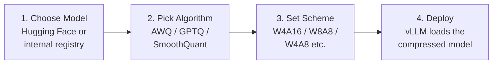
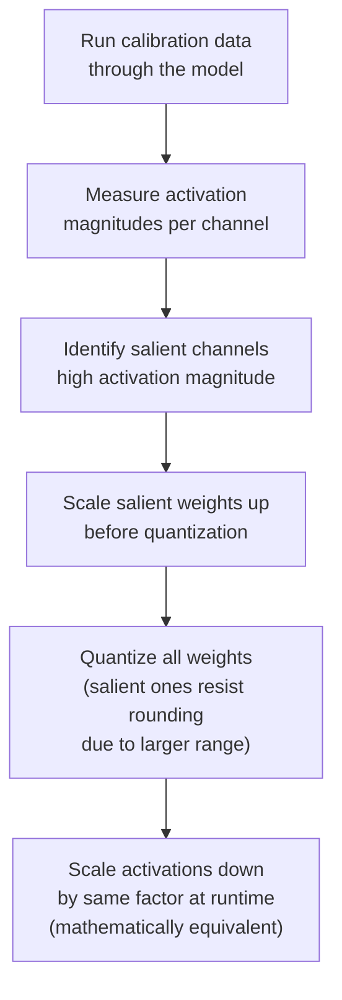
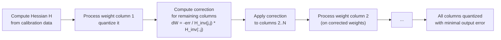
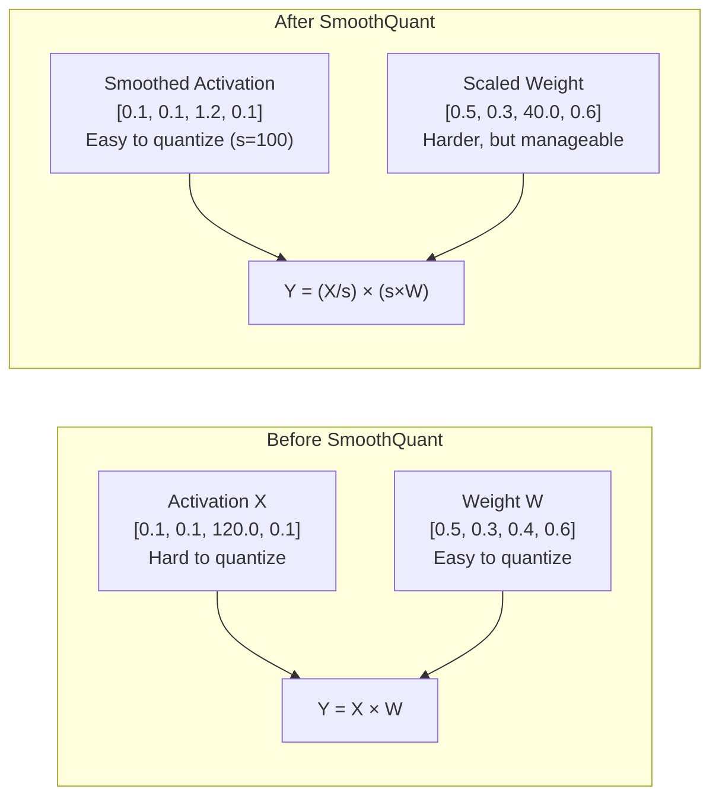
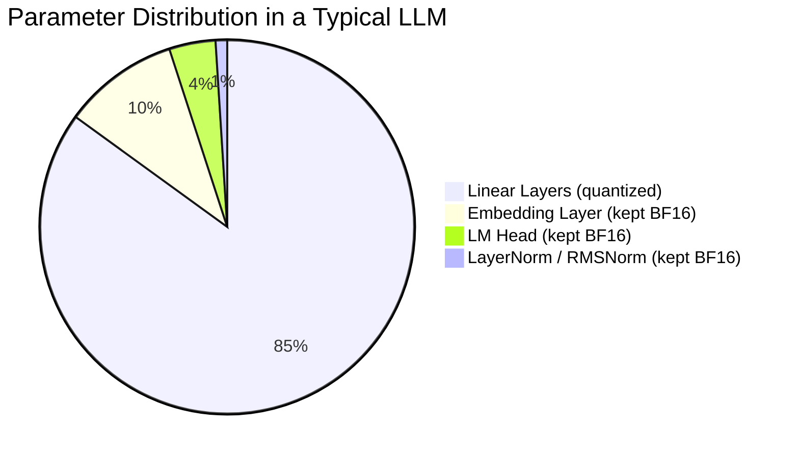
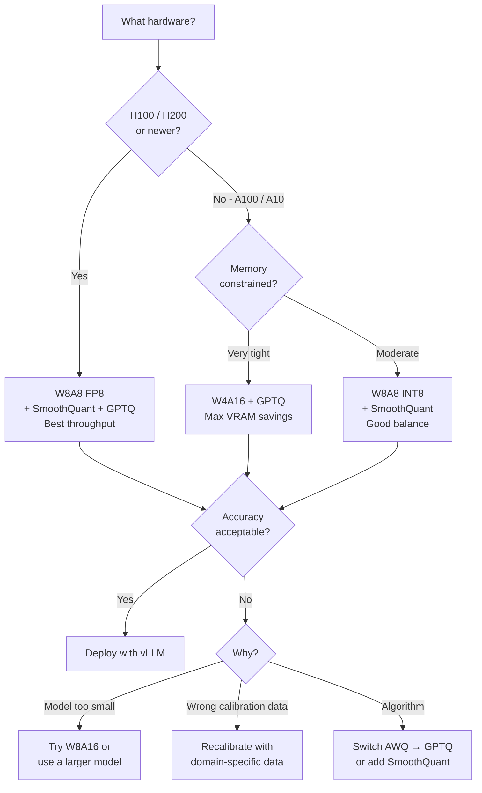

## From Theory to Practice

The [previous post](/blog/llm-inference-fundamentals) covered *why* quantization matters: weights eat VRAM, decode is memory-bandwidth-bound, and dropping from BF16 to INT8/INT4 directly translates to fewer GPUs and faster token generation. But understanding what quantization does is different from knowing how to do it without breaking the model.

This post is the practical half. We'll cover:
- What the main compression algorithms actually do under the hood (not just "round to fewer bits")
- When to choose GPTQ vs AWQ vs SmoothQuant
- The end-to-end workflow with **LLM Compressor**, the production tool from the vLLM project
- How to evaluate whether the compressed model is still usable

<Callout label="Tool: LLM Compressor">
LLM Compressor (`llm-compressor`) is the open-source quantization toolkit from the vLLM project. It takes any Hugging Face model and compresses it in a single pass — no retraining. The output is a model that vLLM can serve directly.
</Callout>

---

## The Four-Step Compression Workflow



Steps 1–3 happen at **compression time**, offline, before any serving infrastructure is involved. The result is a set of model files that vLLM can load exactly like a normal model — the compression is transparent to the serving layer.

---

## Understanding the Algorithms

### Round-to-Nearest (RTN): The Baseline

The simplest possible approach: round every weight value to the nearest representable value in the target format.

```python
def round_to_nearest(weight: torch.Tensor, bits: int) -> torch.Tensor:
    qmin = -(2 ** (bits - 1))
    qmax = 2 ** (bits - 1) - 1
    
    # Per-tensor scale factor
    scale = weight.abs().max() / qmax
    
    # Quantize → round → dequantize
    q = torch.clamp((weight / scale).round(), qmin, qmax)
    return q * scale  # dequantized (same dtype, but precision reduced)
```

**When to use it**: Quick sanity checks and baselines. Fast, requires no calibration data.

**Why not in production**: At INT8 it's acceptable. At INT4 it causes noticeable accuracy degradation because it treats every weight as equally important — which they aren't.

---

### AWQ: Activation-Aware Weight Quantization

AWQ is built on a key observation: **not all weights have equal impact on model outputs**.

Some weights, when changed even slightly, cause large shifts in what the model predicts. Others can be rounded aggressively without visible effect. The difference correlates with the magnitude of the **activations** that flow through them — weights connected to large activations carry more signal.



The scaling trick is elegant: if a weight $W$ is multiplied by scale $s$ before quantization and activations $X$ are divided by $s$ at runtime, the product $W \cdot X$ is unchanged. But now the salient weights have a larger range, so the quantization step is finer relative to their true values — less information is lost.

```python
from llmcompressor.modifiers.quantization import AWQModifier

recipe = AWQModifier(
    scheme="W4A16",
    targets="Linear",
    ignore=["lm_head"],
)
```

**Advantages**: Lighter to run than GPTQ (no Hessian computation). Calibration is faster and needs less VRAM. Works well on consumer hardware.

**Limitation**: Operates channel-by-channel using first-order statistics. GPTQ has a more complete view of weight interactions.

---

### GPTQ: The Industry Standard

GPTQ (Generative Pre-Trained Transformer Quantization) takes a more rigorous approach. Rather than just protecting salient weights, it asks: "given that we must quantize this weight and introduce some error, how do we **compensate** by adjusting the remaining weights in the same row so the layer's output changes as little as possible?"

The answer requires computing the **Hessian** of the layer output with respect to its weights — a second-order measure of how sensitive the output is to changes in each weight.

For a linear layer $Y = XW$, the optimal quantized weights minimize:

$$
\underset{\hat{W}}{\text{argmin}}\; \|XW - X\hat{W}\|_F^2
$$

GPTQ approximates the Hessian as $H = 2XX^\top$ (computed from calibration activations $X$), then works through columns of $W$ left to right. When column $j$ is quantized:

$$
\delta_F = -\frac{w_j - \text{quant}(w_j)}{[H_F^{-1}]_{jj}} \cdot (H_F^{-1})_{:,j}
$$

That correction $\delta_F$ is applied to all remaining unquantized columns $F$ to compensate for the error just introduced in column $j$.



```python
from llmcompressor.modifiers.quantization import GPTQModifier

recipe = GPTQModifier(
    scheme="W4A16",
    targets="Linear",
    ignore=["lm_head"],
    dampening_frac=0.01,  # Hessian damping for numerical stability
)
```

**Why dampening?** The Hessian inversion can be numerically unstable for near-zero eigenvalues. Adding a small diagonal term ($H \leftarrow H + \lambda I$) stabilizes it.

**Advantages**: Highest accuracy at INT4. Most widely supported. The safe default when sharing a compressed model publicly.

**Cost**: Computing and inverting the Hessian per layer is expensive — more VRAM and time than AWQ. On a 70B model, GPTQ calibration can take 30–60 minutes on a 4×H100 node.

---

### SmoothQuant: Solving the Activation Outlier Problem

The schemes above quantize **weights only** (W4A16, W8A16). For full W8A8 quantization — where both weights and activations are quantized — a different problem appears.

Activations in transformer models have **outliers**: a small number of channels consistently produce values 10–100× larger than the average. These outliers make INT8 quantization of activations difficult because the dynamic range has to accommodate the outliers, leaving almost all precision wasted on the normal values.



SmoothQuant migrates the quantization difficulty from activations to weights by introducing per-channel smoothing scales $s$:

$$
Y = X W = (X \cdot \text{diag}(s)^{-1}) \cdot (\text{diag}(s) \cdot W) = \hat{X} \hat{W}
$$

Weights are easier to quantize (static, can be handled offline) so the trade is favorable. The migration strength is controlled by a hyperparameter $\alpha \in [0, 1]$: $\alpha = 0.5$ splits difficulty evenly.

```python
from llmcompressor.modifiers.quantization import GPTQModifier
from llmcompressor.modifiers.smoothquant import SmoothQuantModifier

# Chain SmoothQuant before GPTQ for W8A8
recipe = [
    SmoothQuantModifier(smoothing_strength=0.8),  # migrate outliers to weights
    GPTQModifier(scheme="W8A8", targets="Linear", ignore=["lm_head"]),
]
```

SmoothQuant is typically **chained before GPTQ or AWQ** when targeting W8A8, since it prepares activations to be quantizable without significant accuracy loss.

---

## Quantization Scheme Selection

Choosing the right scheme is a tradeoff between memory savings, compute speedup, and accuracy:

| Scheme | Weights | Activations | Memory Savings | Tensor Core Speedup | Best Use Case |
|--------|---------|-------------|---------------|--------------------|-|
| W8A16 | INT8 | BF16 | ~50% | None (BF16 math) | Safe first step, older hardware |
| W4A16 | INT4 | BF16 | ~75% | None | Decode-heavy, latency-sensitive |
| W8A8 | INT8/FP8 | INT8/FP8 | ~50% | Yes (2×+) | High-throughput batch serving |
| W4A8 | INT4 | INT8 | ~75% | Partial | Maximum memory compression + some compute gain |

<Callout label="The H100/B200 Default">
On Hopper-generation hardware (H100, H200, B200), **W8A8 FP8** is typically the right default. FP8 Tensor Cores deliver up to 2× the compute of BF16. If you're on older Ampere hardware (A100), INT8 W8A8 is the equivalent. Use W4A16 when you're serving long-context requests and KV cache memory is the bottleneck.
</Callout>

---

## LLM Compressor: End-to-End Walkthrough

### Installation

```bash
pip install llmcompressor
# Optionally, for GPU-accelerated calibration:
pip install vllm  # also installs llmcompressor as a dependency
```

### Full W4A16 GPTQ Workflow

```python
import os
import torch
from transformers import AutoTokenizer, AutoModelForCausalLM
from llmcompressor import oneshot
from llmcompressor.modifiers.quantization import GPTQModifier

MODEL_ID = "meta-llama/Meta-Llama-3-8B"
OUTPUT_DIR = "./llama3-8b-w4a16-gptq"

recipe = GPTQModifier(
    scheme="W4A16",
    targets="Linear",
    ignore=["lm_head"],
    dampening_frac=0.01,
)

if not os.path.isdir(OUTPUT_DIR):
    oneshot(
        model=MODEL_ID,
        dataset="wikitext",
        dataset_config_name="wikitext-2-raw-v1",
        recipe=recipe,
        output_dir=OUTPUT_DIR,
        max_seq_length=4096,
        num_calibration_samples=256,
    )
```

### W8A8 Workflows: FP8 (H100) and INT8

FP8 and INT8 W8A8 take different paths in LLM Compressor. FP8 with dynamic activations needs **no calibration data** — it's the simplest way to get full W8A8 on Hopper:

```python
from llmcompressor.modifiers.quantization import QuantizationModifier

# FP8 weights + dynamic FP8 activations — no calibration dataset required.
recipe = QuantizationModifier(
    targets="Linear",
    scheme="FP8_DYNAMIC",
    ignore=["lm_head"],
)

oneshot(model="meta-llama/Meta-Llama-3-70B", recipe=recipe, output_dir="./llama3-70b-fp8")
```

INT8 W8A8 has static activation quantization, so it *does* need calibration — and this is where you chain SmoothQuant before GPTQ to tame activation outliers:

```python
from llmcompressor.modifiers.quantization import GPTQModifier
from llmcompressor.modifiers.smoothquant import SmoothQuantModifier

recipe = [
    SmoothQuantModifier(smoothing_strength=0.8),          # migrate outliers to weights
    GPTQModifier(scheme="W8A8", targets="Linear", ignore=["lm_head"]),
]

oneshot(
    model="meta-llama/Meta-Llama-3-70B",
    dataset="ultrachat_200k",   # more representative for chat models
    recipe=recipe,
    output_dir="./llama3-70b-int8",
    max_seq_length=2048,
    num_calibration_samples=512,
)
```

### AWQ vs GPTQ: Pick One, Don't Chain

AWQ and GPTQ are *alternative* weight-quantization algorithms — both take BF16 weights down to (say) W4A16. Running both on the same layers doesn't stack their benefits; the second one just re-quantizes already-quantized weights. Choose based on your constraint:

- **AWQ** — faster calibration, lighter VRAM, strong on consumer GPUs
- **GPTQ** — higher accuracy at INT4, the safe default for sharing publicly

What you *do* chain is a **transform** before a quantizer. SmoothQuant (or a rotation like QuIP / SpinQuant) reshapes the distribution first, then a single quantizer does the rounding:

```python
from llmcompressor.modifiers.smoothquant import SmoothQuantModifier
from llmcompressor.modifiers.quantization import GPTQModifier

recipe = [
    SmoothQuantModifier(smoothing_strength=0.8),  # a transform, not a quantizer
    GPTQModifier(scheme="W4A16", targets="Linear", ignore=["lm_head"]),
]
```

---

## Calibration Data: The Most Underrated Parameter

The calibration dataset is what separates good quantization from degraded quantization. The model runs this data forward-pass-only to measure weight sensitivity — no gradients, no training.

### The Two Key Parameters

**`num_calibration_samples`** — how many text sequences to use.

```python
# Sweet spot: 128–512 samples
# Past ~512, accuracy gains become marginal while runtime keeps growing.
# 256 is a solid default for general-purpose models.
num_calibration_samples = 256
```

**`max_seq_length`** — max tokens per sample.

```python
# Should match your deployment's typical context length.
# Too short: the quantizer doesn't see how weights behave at realistic lengths.
# Too long: slower calibration, more VRAM needed.
max_seq_length = 4096  # good for most production deployments
```

### Choosing the Right Dataset

The calibration data should match the distribution your model will actually see in production. Using WikiText-2 (Wikipedia) for a code-generation model calibrates on the wrong distribution.

| Deployment Type | Recommended Calibration Data |
|-----------------|------------------------------|
| General chat | `HuggingFaceH4/ultrachat_200k` |
| Code generation | `iamtarun/code_instructions_120k_alpaca` or `codeparrot/github-code` |
| RAG / long-document | `wikitext`, `pg19` (long-form text) |
| Domain-specific (legal, medical) | A sample from your own fine-tuning corpus |
| Quick baseline | `wikitext-2-raw-v1` (always works, not always optimal) |

```python
# For a RAG deployment, use long-context data
oneshot(
    model=MODEL_ID,
    dataset="wikitext",
    dataset_config_name="wikitext-2-raw-v1",
    recipe=recipe,
    output_dir=OUTPUT_DIR,
    max_seq_length=8192,        # match your RAG context window
    num_calibration_samples=256,
)
```

<Callout label="Data leakage warning">
If you evaluate perplexity on WikiText-2 test split, use WikiText-2 for calibration too — but keep the splits separate. The `oneshot` API uses the `train` split by default; perplexity is measured on `test`. Never calibrate on the same data you evaluate on.
</Callout>

---

## Why 4× Precision Reduction ≠ 75% Size Reduction

This trips up almost everyone the first time.

You'd expect W4A16 (16-bit → 4-bit) to shrink the model to 25% of its original size — a 75% reduction. In practice for a 0.6B model, the reduction is around **42%**. For large models it gets closer to 70%.

Why the gap?

```python
def analyze_model_compression(model_path: str, quantized_path: str):
    import pathlib
    
    def folder_size_gb(path):
        return sum(f.stat().st_size for f in pathlib.Path(path).rglob("*") if f.is_file()) / 1e9
    
    orig_gb = folder_size_gb(model_path)
    quant_gb = folder_size_gb(quantized_path)
    reduction = (1 - quant_gb / orig_gb) * 100
    
    print(f"Original:   {orig_gb:.2f} GB")
    print(f"Quantized:  {quant_gb:.2f} GB")
    print(f"Reduction:  {reduction:.0f}%")
    return reduction
```

The layers that **don't** get quantized:



For a **0.6B model**: the embedding and LM head are proportionally large — they account for ~30–40% of parameters (vocab size × d_model is significant at small scale). So the "bulk" of the model that gets 4× compressed is only 60–70% of the total.

For a **70B model**: the embedding is a tiny fraction. Linear layers dominate at >95% of parameters. W4A16 gets you close to the theoretical 75% reduction.

```python
# Only the linear layers get the 4x (16-bit -> 4-bit) reduction.
# The embedding, LM head, and norm layers stay at full precision, so the
# overall reduction depends on how small that non-quantized share is.
def theoretical_reduction(non_quantized_frac, source_bits=16, weight_bits=4):
    quantized_frac = 1 - non_quantized_frac
    avg_bits_after = quantized_frac * weight_bits + non_quantized_frac * source_bits
    return (1 - avg_bits_after / source_bits) * 100

# Approximate non-quantized (embedding + head + norm) share of params by size.
# It shrinks fast as d_model grows relative to a fixed-ish vocab.
for name, nq_frac in [("0.6B", 0.410), ("7B", 0.105), ("14B", 0.055), ("70B", 0.015)]:
    r = theoretical_reduction(nq_frac)
    print(f"{name:>5}: non-quantized share={nq_frac:>6.1%}  ->  size reduction={r:.0f}%")
```

```
  0.6B: non-quantized share= 41.0%  ->  size reduction=44%
    7B: non-quantized share= 10.5%  ->  size reduction=67%
   14B: non-quantized share=  5.5%  ->  size reduction=71%
   70B: non-quantized share=  1.5%  ->  size reduction=74%
```

The empirical 42% from the notebook lines up with the ~44% predicted here for a 0.6B model — the small gap is quantization metadata (per-group scales and zero-points) that INT4 storage adds on top of the packed weights.

---

## Evaluating the Compressed Model

### Perplexity: The Standard Signal

Perplexity measures how well the model predicts text. Mathematically it's the exponentiated average negative log-likelihood:

$$
\text{PPL} = \exp\!\left(-\frac{1}{N}\sum_{i=1}^{N} \log P(t_i \mid t_1, \ldots, t_{i-1})\right)
$$

Lower is better. A model with perplexity 30 is more "surprised" by test text than one with perplexity 20, meaning it assigns lower probability to the actual next tokens.

```python
import math
import torch
from datasets import load_dataset
from transformers import AutoTokenizer, AutoModelForCausalLM

def calculate_perplexity(
    model: AutoModelForCausalLM,
    tokenizer: AutoTokenizer,
    dataset,
    max_tokens: int = 8192,
    stride: int = 512,
) -> float:
    text = "\n\n".join(dataset["text"])
    encodings = tokenizer(text, return_tensors="pt", truncation=True, max_length=max_tokens)
    input_ids = encodings.input_ids

    nlls, prev_end = [], 0
    for begin_loc in range(0, input_ids.size(1), stride):
        end_loc = min(begin_loc + stride, input_ids.size(1))
        trg_len = end_loc - prev_end
        input_slice = input_ids[:, begin_loc:end_loc]
        
        labels = input_slice.clone()
        labels[:, :-trg_len] = -100  # only compute loss on the new tokens

        with torch.no_grad():
            loss = model(input_slice, labels=labels).loss
        nlls.append(loss * trg_len)
        prev_end = end_loc

    return math.exp(torch.stack(nlls).sum() / prev_end)

# Load held-out test split (different from calibration data)
test_data = load_dataset("wikitext", "wikitext-2-raw-v1", split="test")

base_ppl = calculate_perplexity(base_model, tokenizer, test_data)
quant_ppl = calculate_perplexity(quant_model, tokenizer, test_data)

print(f"Base (BF16):       {base_ppl:.2f}")
print(f"Quantized (W4A16): {quant_ppl:.2f}")
print(f"Degradation:       {(quant_ppl/base_ppl - 1)*100:+.1f}%")
```

```
Base (BF16):       32.79
Quantized (W4A16): 35.48
Degradation:       +8.2%
```

### What's an Acceptable Degradation?

For the Qwen3-0.6B model used in the notebook, an 8% perplexity increase at W4A16 is reasonable — small models are inherently harder to compress because the embedding/LM head is a bigger fraction of total capacity.

General thresholds from practice:

| Model Size | W8A8 FP8 | W4A16 | W4A8 |
|------------|----------|-------|------|
| 0.6B | ~2–4% | ~6–10% | ~12–18% |
| 7B | ~1–2% | ~3–5% | ~6–10% |
| 70B | &lt;1% | ~1–3% | ~3–6% |

**Important**: perplexity is a general proxy. For production, always also run task-specific evals on your actual use case.

### Task-Specific Benchmarks

```python
# lm-evaluation-harness is the standard for task-specific evaluation
# pip install lm-eval

# Evaluate on MMLU (general knowledge)
# lm_eval --model hf --model_args pretrained=./quantized-model --tasks mmlu --num_fewshot 5

# Evaluate on GSM8K (math reasoning)
# lm_eval --model hf --model_args pretrained=./quantized-model --tasks gsm8k --num_fewshot 5

# Evaluate on HumanEval (code generation)
# lm_eval --model hf --model_args pretrained=./quantized-model --tasks humaneval
```

A model that loses 8% perplexity on Wikipedia text might lose only 1% on a domain-specific task — or 15% if Wikipedia is far from your domain. Always verify on the task you care about.

---

## The Compression Decision Tree



---

## Practical Notes for Production

**Saving the compressed model correctly.** The `oneshot` API handles this automatically, but if you're building a custom pipeline, use `save_pretrained` with the quantization config intact:

```python
model.save_pretrained(OUTPUT_DIR, save_compressed=True)
tokenizer.save_pretrained(OUTPUT_DIR)
# Quantization details are written into config.json (compressed-tensors format);
# vLLM reads them automatically when it loads the model.
```

**Loading for inference with vLLM** (covered in the next post, but good to know now):

```python
from vllm import LLM

# vLLM auto-detects quantization from quantize_config.json
llm = LLM(model="./llama3-8b-w4a16-gptq")
```

**Sharing quantized models.** GPTQ-compressed models pushed to Hugging Face are directly usable by anyone with vLLM. AWQ models are also widely supported. The convention is to include the scheme in the repo name:

```
your-org/llama3-8b-w4a16-gptq
your-org/llama3-70b-fp8
```

**Multi-GPU quantization.** For 70B+ models, calibration itself can OOM on a single 80GB GPU because the Hessian computation requires holding activations. Load the model sharded across all visible GPUs with `device_map="auto"`, then hand the model object to `oneshot`:

```python
from transformers import AutoModelForCausalLM

# Shard the model across every visible GPU for calibration
model = AutoModelForCausalLM.from_pretrained(
    "meta-llama/Meta-Llama-3-70B",
    device_map="auto",
    torch_dtype="auto",
)

oneshot(
    model=model,
    recipe=recipe,
    output_dir=OUTPUT_DIR,
    dataset="ultrachat_200k",
    num_calibration_samples=512,
    max_seq_length=2048,
)
```

---

## Summary

<div className="space-y-3 mt-3">

<StepCard n={1} title="Pick your algorithm based on accuracy vs. speed tradeoff">
GPTQ for highest accuracy at INT4 (expensive to run but worth it). AWQ for faster calibration with good results. SmoothQuant always before W8A8 to handle activation outliers.
</StepCard>

<StepCard n={2} title="Choose the right scheme for your hardware">
W8A8 FP8 on H100+ for throughput. W4A16 when VRAM is the constraint. W8A16 as a safe first step on any hardware.
</StepCard>

<StepCard n={3} title="Calibrate on representative data">
256 samples at your deployment context length is the baseline. Match the data distribution to your actual workload — generic Wikipedia calibration on a code model will leave accuracy on the table.
</StepCard>

<StepCard n={4} title="Evaluate beyond perplexity">
Perplexity tells you if the model is generally degraded. Task-specific benchmarks tell you if it's degraded on what you care about. Use both.
</StepCard>

</div>

The compressed model is now ready to serve. The next post covers what happens when you actually deploy it — continuous batching, PagedAttention, and how vLLM makes the GPU work at capacity.

---

*This post is based on [Fast & Efficient LLM Inference with vLLM](https://www.deeplearning.ai/courses/fast-and-efficient-llm-inference-with-vllm), a short course from DeepLearning.AI built in partnership with Red Hat and taught by Cedric Clyburn (Senior Developer Advocate, Red Hat). Full credit for the course material goes to DeepLearning.AI and Red Hat. This post adds independent depth on production compression workflows and evaluation methodology. [LLM Compressor](https://github.com/vllm-project/llm-compressor) and [vLLM](https://github.com/vllm-project/vllm) are open-source projects maintained by the vLLM project and Red Hat.*

*Written by Vatsal Thakkar*
