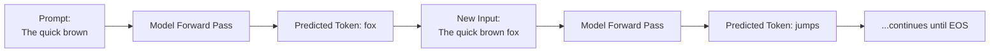
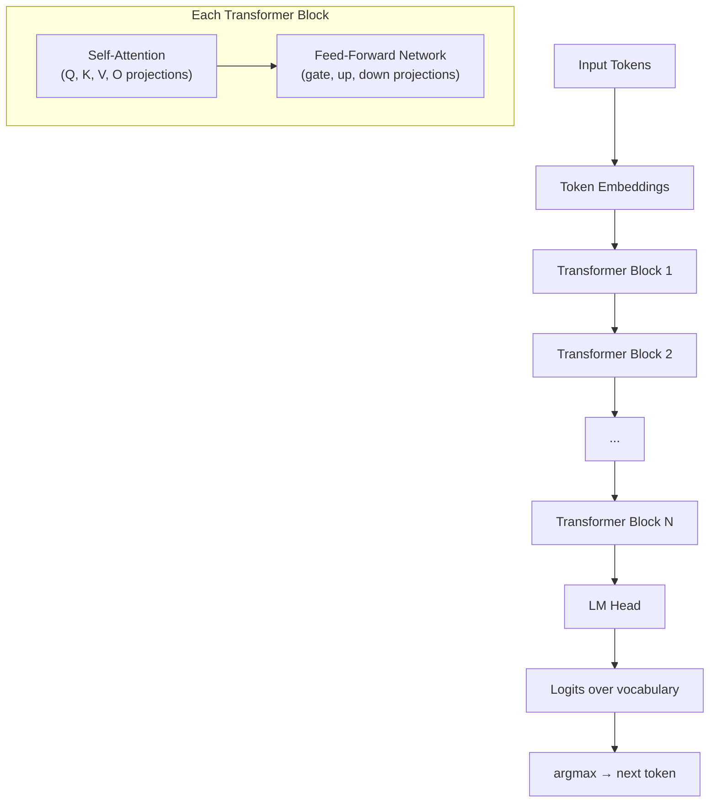
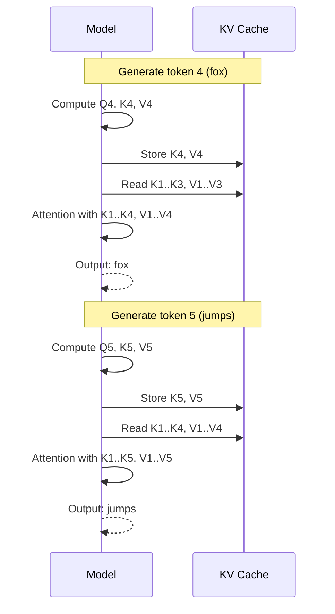
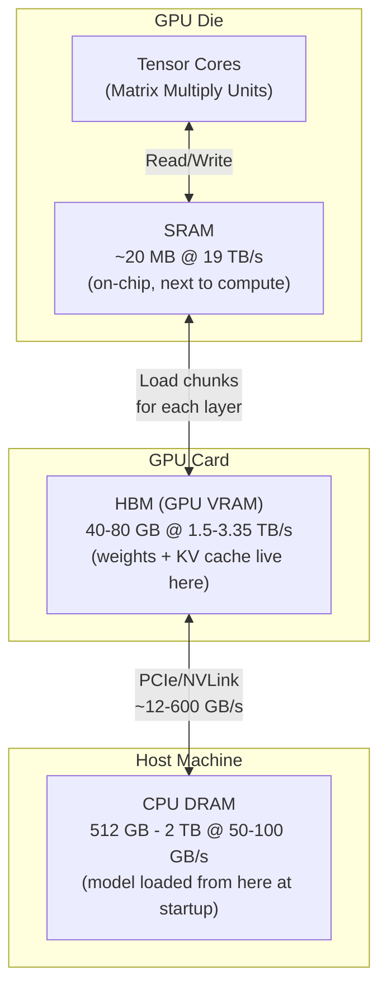
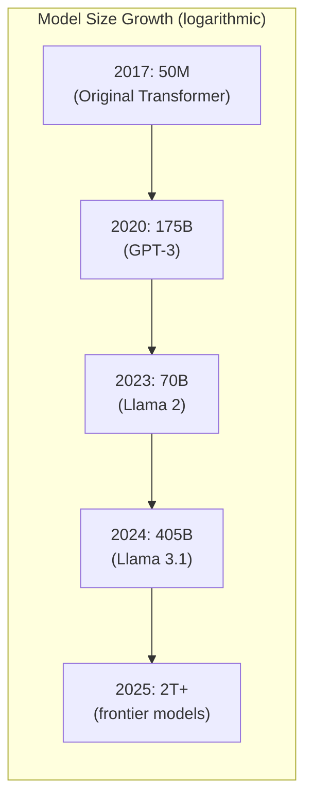
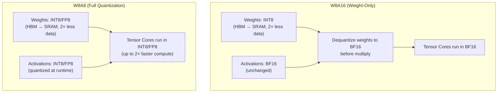

## Why Inference Is the Real Cost

Everyone talks about training — the massive GPU clusters, weeks of compute, and billions of dollars. But training happens **once**. Inference happens **every single time a user sends a message**.

That asymmetry is important. A model trained on 10,000 GPUs gets served to millions of users on a fleet of inference servers that run 24/7. The per-token cost of inference, multiplied across all those requests, dwarfs the one-time training bill.

<Callout label="The shift in 2023">
In early 2023, there were essentially no competitive open-source models. Now there are thousands on Hugging Face — from Meta, Alibaba, Google, and even OpenAI. The challenge shifted from "can I get a good model?" to "can I run that model efficiently?"
</Callout>

### Why Run Models Yourself?

Calling a managed API (GPT-4, Claude API) is easy, but at scale it gets expensive fast. Self-hosting has four advantages:

<div className="space-y-3 mt-3">

<BulletCard title="Cost Savings">
Pay per GPU-hour instead of per token. Match model size to task difficulty — a 7B model can answer FAQ queries just as well as a 70B, at a tenth of the cost.
</BulletCard>

<BulletCard title="Security & Data Privacy">
Data never leaves your environment. Critical in healthcare (HIPAA), finance (SOC 2), and enterprise settings where sending customer data to a third-party API isn't acceptable.
</BulletCard>

<BulletCard title="Control">
Models upgrade or deprecate when **you** decide. No rate limits, no surprise API changes, no third-party downtime in your SLA.
</BulletCard>

<BulletCard title="Customization">
Fine-tune on your domain data. Adjust serving parameters — batch sizes, context lengths, sampling strategies — based on your actual workload profile.
</BulletCard>

</div>

---

## Measuring What Matters: Production SLOs

Like any production system, LLM deployments need measurable targets. We use **Service Level Objectives (SLOs)** across two dimensions.

### Accuracy SLOs

A model that's fast but wrong isn't useful. Model cards publish benchmark comparisons between the original and any optimized versions. For example, Llama 3.1 70B's optimized variant retains 99.88% of the original's accuracy across MMLU (general knowledge), GSM8K (math), and similar benchmarks. That recovery score is what you verify before deploying an optimized model.

### Inference Performance SLOs

There are four metrics that matter in production:

| Metric | Definition | Why It Matters |
|--------|-----------|----------------|
| **TTFT** (Time to First Token) | Time from request to first output token | Perceived responsiveness — the user is waiting |
| **ITL** (Inter-Token Latency) | Average time between consecutive tokens | Smoothness of streaming output |
| **Request Latency** | Total end-to-end time | SLA for batch/offline jobs |
| **Throughput** | Output tokens per second across all requests | Can your system handle production load? |

For a chat application, TTFT and ITL matter most — users notice lag. For a document processing pipeline, throughput is the number that controls your batch time.

---

## How LLMs Actually Generate Text

### Autoregressive Generation

LLMs don't output a full sentence in one shot. They generate **one token at a time** in a loop called autoregressive generation:



Each token requires a complete forward pass through every layer of the model. A 500-token response means the model runs 500 times. This loop is fundamental — it's why inference optimization matters so much.

### Inside a Forward Pass

When you send a prompt, here's the computation path:



Every box labeled "projection" is a **matrix multiplication** — a linear layer. These are where:
- Almost all model parameters live
- Almost all computation happens
- All optimization efforts are focused

---

## Self-Attention: The Mechanism That Drives Memory Pressure

Self-attention is where tokens look at each other. For each token, three vectors are computed via linear layers:

- **Q (Query)**: "What information do I need from context?"
- **K (Key)**: "What kind of information do I contain?"
- **V (Value)**: "Here's my actual content if my key matches your query."

The attention computation for token $i$ attending to all previous tokens:

$$
\text{Attention}(Q_i, K_{1:i}, V_{1:i}) = \text{softmax}\!\left(\frac{Q_i K_{1:i}^\top}{\sqrt{d_k}}\right) V_{1:i}
$$

The $\frac{1}{\sqrt{d_k}}$ scaling prevents dot products from growing large enough to push softmax gradients toward zero.

```python
import torch
import torch.nn.functional as F

def causal_self_attention(Q, K, V):
    d_k = Q.size(-1)
    scores = torch.matmul(Q, K.transpose(-2, -1)) / d_k ** 0.5
    
    # Causal mask: token i can only attend to tokens 1..i
    seq_len = Q.size(-2)
    mask = torch.tril(torch.ones(seq_len, seq_len, device=Q.device)).bool()
    scores = scores.masked_fill(~mask, float('-inf'))
    
    weights = F.softmax(scores, dim=-1)
    return torch.matmul(weights, V)
```

Here's the critical observation: **generating token $i+1$ requires the K and V vectors of all previous tokens**. The Q vector is only needed for the current token, but K and V must span the entire history. This is the foundation of the KV cache.

---

## The KV Cache: The Dominant Memory Problem

### What It Is

Without caching, generating each new token would require recomputing K and V for every previous token — a quadratic waste. The KV cache avoids this by saving K and V tensors in GPU memory as they're computed:



This happens **at every transformer layer**. For a model with 80 layers, the savings multiply by 80.

### How Large Does It Get?

The KV cache size per token is:

$$
\text{KV\_per\_token} = 2 \times N_\text{layers} \times N_\text{heads} \times d_\text{head} \times \text{bytes\_per\_element}
$$

For **Llama 3 70B**:
- 2 (K and V)
- × 80 layers
- × 8 KV heads (it uses Grouped Query Attention)
- × 128 head dimension
- × 2 bytes (BF16)

$$
= 2 \times 80 \times 8 \times 128 \times 2 = 327{,}680 \text{ bytes} \approx 320 \text{ KB per token}
$$

```python
def kv_cache_size_gb(
    n_layers: int,
    n_kv_heads: int,
    head_dim: int,
    n_tokens: int,
    bytes_per_element: int = 2,  # BF16
) -> float:
    per_token = 2 * n_layers * n_kv_heads * head_dim * bytes_per_element
    total_bytes = per_token * n_tokens
    return total_bytes / (1024 ** 3)

# Llama 3 70B at different context lengths
llama_70b = dict(n_layers=80, n_kv_heads=8, head_dim=128)

for ctx_tokens, label in [(2_000, "chat turn"), (8_000, "standard prod"), (32_000, "long doc"), (128_000, "max context")]:
    size = kv_cache_size_gb(**llama_70b, n_tokens=ctx_tokens)
    print(f"{ctx_tokens:>7,} tokens ({label:<14}): {size:.2f} GB")
```

```
  2,000 tokens (chat turn     ):  0.61 GB
  8,000 tokens (standard prod ):  2.44 GB
 32,000 tokens (long doc      ):  9.77 GB
128,000 tokens (max context   ): 39.06 GB
```

One Llama 3 70B user at max context needs **39 GB of KV cache** on top of the 140 GB of model weights. Serve 10 concurrent users at that context length and you need 390 GB of KV cache alone.

<Callout label="Why this is the core problem">
The KV cache lives in GPU memory (HBM), grows linearly with both sequence length and concurrent request count, and cannot be compressed without losing information (unlike weights). Managing it efficiently is the single biggest job of a production inference server.
</Callout>

### The Hardware Reality

For Llama 3 70B in production:
- **Model weights**: 140 GB (fixed, loaded once at startup)
- **Standard deploy**: 4× H100 80GB GPUs = 320 GB total
- **KV headroom**: 320 − 140 = 180 GB
- **Long-context users**: 180 GB ÷ 10 GB/request = 18 users max (with perfect memory management)

A naive serving setup without memory optimization wastes this headroom and drops concurrent capacity from 18 to 2–3 users.

---

## GPU Memory Hierarchy: Why It Shapes Everything

Understanding where tensors live explains every optimization you'll ever see for LLM inference.



Numbers for an **NVIDIA A100**:

| Tier | Capacity | Bandwidth |
|------|----------|-----------|
| SRAM (on-chip) | ~20 MB | ~19 TB/s |
| HBM (VRAM) | 40/80 GB | 1.5–2 TB/s |
| CPU DRAM | varies | ~50 GB/s |

The key insight: the closer to the compute units, the faster — but the smaller. Every forward pass works like this:

1. Chunks of weights and KV cache are **streamed from HBM into SRAM**
2. Tensor Cores perform the matrix multiplication **in SRAM**
3. Transient intermediate tensors (Q, K, V for the current step) are computed and discarded in SRAM
4. This repeats for every linear layer, every transformer block, every token

Two things govern inference speed:
- **Memory bandwidth**: how fast data moves HBM → SRAM
- **Compute throughput**: how fast Tensor Cores operate once data arrives

Every optimization either moves less data, moves it more efficiently, or reorders computation to keep Tensor Cores fed.

### Compute-Bound vs Memory-Bound

This distinction matters enormously in production:

**Prefill phase** (processing the input prompt): The model processes all input tokens in parallel — large matrix multiplications over the full sequence. This is **compute-bound**. Tensor Cores are the bottleneck.

**Decode phase** (generating output tokens one by one): Each step is a small matrix multiply against a single new token. The weight matrices sit idle waiting for data to arrive. This is **memory-bandwidth-bound** — the bottleneck is streaming weights from HBM into SRAM.

```python
# Rough arithmetic intensity for decode (one token through one weight matrix):
# Operation: weight matrix [d_model, d_model] × input vector [d_model]
# Compute: 2 · d_model² FLOPs  (a multiply-accumulate counts as 2 FLOPs)
# Memory:  d_model² weights × 2 bytes (BF16) ≈ 2 · d_model² bytes
# Arithmetic intensity ≈ 1 FLOP/byte → memory-bound on any modern GPU

d_model = 8192  # Llama 3 70B
flops = 2 * d_model ** 2
memory_bytes = d_model ** 2 * 2  # BF16 weights dominate the read
arithmetic_intensity = flops / memory_bytes  # ~1 FLOP/byte
# H100 ratio: 989 TFLOPS BF16 / 3.35 TB/s ≈ 295 FLOP/byte to saturate compute
# At ~1 FLOP/byte we're ~300x below that → decode is memory-bound
```

This is why weight quantization (reducing bytes per weight) directly speeds up decode.

---

## Model Optimization: Quantization

### The Compression Gap

Model sizes have doubled roughly every year. From the original Transformer at 50M parameters in 2017 to today's frontier models pushing past 1 trillion. GPU memory has grown far slower — an H100 has 80 GB, same as the A100 from 2020. The gap between what models need and what hardware provides keeps widening.



This mismatch creates four real problems:
- **More hardware** — bigger models need multi-GPU, multi-node setups
- **Slower responses** — more parameters means more compute per token
- **Less KV cache room** — weights eat VRAM that could serve concurrent users
- **Higher energy cost** — more GPUs running longer

### What Quantization Does

Most LLMs are released in **BF16** — brain float 16, 2 bytes per number. Quantization converts to lower-precision formats:

| Format | Bits | Bytes | Size vs BF16 |
|--------|------|-------|--------------|
| BF16 | 16 | 2.0 | baseline |
| FP8 | 8 | 1.0 | 2× smaller |
| INT8 | 8 | 1.0 | 2× smaller |
| INT4/FP4 | 4 | 0.5 | 4× smaller |

For **Llama 4 Scout** (109B parameters):

```python
params = 109e9

bf16_gb   = params * 2 / 1e9   # 218 GB → needs 3× 80GB GPUs
int8_gb   = params * 1 / 1e9   # 109 GB → needs 2× 80GB GPUs
int4_gb   = params * 0.5 / 1e9 #  54 GB → fits on 1× 80GB GPU

print(f"BF16:  {bf16_gb:.0f} GB (3 GPUs)")
print(f"INT8:  {int8_gb:.0f} GB (2 GPUs)")
print(f"INT4:  {int4_gb:.0f} GB (1 GPU)")
```

```
BF16:  218 GB (3 GPUs)
INT8:  109 GB (2 GPUs)
INT4:   54 GB (1 GPU)
```

### What Gets Quantized

Quantization targets the **linear layers inside transformer blocks** — the Q, K, V, O projections in Self-Attention, and the gate/up/down projections in the Feed-Forward Network. Not the embedding layer or LM head (those are typically kept at full precision to preserve accuracy).

Two things can be quantized in each linear layer:

**Weights** — the learned parameter matrices. Static at inference time, loaded from HBM.

**Activations** — the input tensors flowing through each linear layer at runtime. Dynamic, computed fresh each forward pass.

### Weight-Only vs. Full Quantization



| Scheme | Memory Win | Compute Win |
|--------|-----------|-------------|
| W8A16 | Yes (2× less data movement) | No (still BF16 math) |
| W8A8 | Yes | Yes (FP8/INT8 Tensor Cores) |
| W4A16 | Yes (4× less) | No |

W8A8 unlocks both wins — less data to move from HBM, and faster Tensor Core throughput because modern GPUs (Hopper H100, Ada RTX 40xx) have dedicated FP8 Tensor Cores that outperform BF16 ones.

### Naive vs. Calibrated Quantization

The obvious approach — round every weight to the nearest representable value — hurts accuracy noticeably. What works in practice are calibrated techniques:

**GPTQ** — solves a per-layer reconstruction problem. After quantizing a weight, it adjusts the remaining weights in that layer to compensate for the quantization error. Uses a small calibration dataset.

**AWQ** (Activation-aware Weight Quantization) — identifies salient weights (those that activate frequently with high magnitude) and protects them. Uses per-channel scaling factors.

**SmoothQuant** — addresses the core challenge of W8A8: activations have outliers that are hard to quantize. Migrates the quantization difficulty from activations to weights by smoothing the distribution.

```python
from transformers import AutoModelForCausalLM, AutoTokenizer
from awq import AutoAWQForCausalLM

model_path = "meta-llama/Meta-Llama-3-8B"
quant_path = "llama3-8b-awq"

# Load model for quantization
model = AutoAWQForCausalLM.from_pretrained(model_path)
tokenizer = AutoTokenizer.from_pretrained(model_path)

quant_config = {
    "zero_point": True,
    "q_group_size": 128,
    "w_bit": 4,        # INT4 weights
    "version": "GEMM"
}

# Calibration on a small dataset — this is what prevents accuracy loss
model.quantize(tokenizer, quant_config=quant_config)
model.save_quantized(quant_path)
```

### Real-World Accuracy: FP8 on Reasoning Benchmarks

A common concern: "doesn't quantization hurt the model?" When done with calibration techniques, essentially no. Results on Llama and Qwen models evaluated on AIME 2024 (competition math), MATH-500, and GPQA-Diamond (expert science):

| Model | BF16 | FP8 W8A8 | INT8 W8A8 | INT4 W4A16 |
|-------|------|----------|-----------|------------|
| Llama 8B | baseline | ≈ baseline | ≈ baseline | ≈ baseline |
| Qwen 14B | 73.6 | **74.3** | ≈ 73.4 | 72.8 |
| Qwen 32B | baseline | ≈ baseline | ≈ baseline | ≈ baseline |

The Qwen 14B FP8 model scored *higher* than BF16 — not because quantization made it smarter, but because the difference is within run-to-run variance. The key point: 4× compression (INT4) loses less than 1 accuracy point.

### Sparsification: The Other Compression Lever

Quantization reduces precision. Sparsification goes further: it **zeros out weights that contribute least** to the model's predictions.

**2:4 structured sparsity** (NVIDIA's format): in every group of 4 consecutive weights, 2 are forced to zero. This halves the effective weight storage and computation, and NVIDIA's Ampere/Hopper Sparse Tensor Cores can exploit this pattern directly for up to a 2× speedup.

Note that true 2:4 sparsity needs the specific "2 zeros in every 4" mask *plus* a hardware kernel — generic magnitude pruning won't hit the Sparse Tensor Core path. In practice you produce it with a calibrated method like SparseGPT (covered in the next post's tooling):

```python
from llmcompressor.modifiers.pruning import SparseGPTModifier

recipe = SparseGPTModifier(
    sparsity=0.5,
    mask_structure="2:4",   # 2 of every 4 weights zeroed
    targets="Linear",
)
# Serve the result on Ampere/Hopper, where 2:4 Sparse Tensor Cores do the rest.
```

Quantization and sparsification compose — a 4-bit, 50%-sparse model can use up to ~8× less memory than its BF16 dense original.

---

## The Full Cost Picture

Putting it all together, here's what each optimization layer saves when serving a production LLM:

```mermaid
graph LR
    A["Naive BF16\n1 request/time\n$$$$$"] -->|"vLLM + Continuous\nBatching + KV Mgmt"| B["vLLM BF16\nMany requests/time\n$$$"]
    B -->|"W8A8 Quantization"| C["vLLM + FP8\nMore throughput/GPU\n$"]
```

From the course's cost example on Llama 3 70B:
- **Naive single-request BF16**: hundreds of thousands of dollars/month at scale
- **Add vLLM continuous batching**: ~10× cost reduction
- **Add FP8 quantization**: further cuts GPU count in half

Real throughput numbers from the course (Llama 3 70B, 2× H100, RAG workload with 1024-token input / 128-token output):

| Metric | FP16 baseline | FP8 W8A8 | Improvement |
|--------|---------------|----------|-------------|
| Throughput (tokens/sec) | 158 | 474 | **3× higher** |
| TTFT at high load | 30,000 ms | 4,800 ms | **6× lower** |

The throughput gain is from Tensor Core efficiency. The TTFT gain is from less data movement per forward pass — 30 seconds of waiting collapses to under 5.

---

## What's Next

This post covered the three foundational layers:
1. **Why inference economics drive optimization** — training is one-time, serving is forever
2. **How the KV cache dominates memory** — growing with sequence length and request concurrency
3. **How quantization addresses both memory and compute** — without meaningful accuracy loss

The next post dives into the actual compression workflow: using **LLM Compressor** to apply GPTQ, AWQ, and SmoothQuant in practice, run calibration datasets, and verify the compressed model before deploying it.

---

*This post is based on [Fast & Efficient LLM Inference with vLLM](https://www.deeplearning.ai/courses/fast-and-efficient-llm-inference-with-vllm), a short course from DeepLearning.AI built in partnership with Red Hat and taught by Cedric Clyburn (Senior Developer Advocate, Red Hat). Full credit for the course material goes to DeepLearning.AI and Red Hat. This post adds independent depth on production systems and memory arithmetic. The open-source tools referenced — [vLLM](https://github.com/vllm-project/vllm) and [LLM Compressor](https://github.com/vllm-project/llm-compressor) — are maintained by the vLLM project and Red Hat.*

*Written by Vatsal Thakkar*
