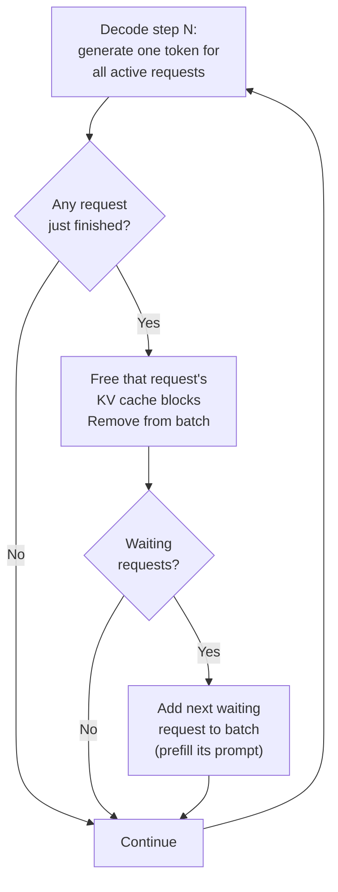
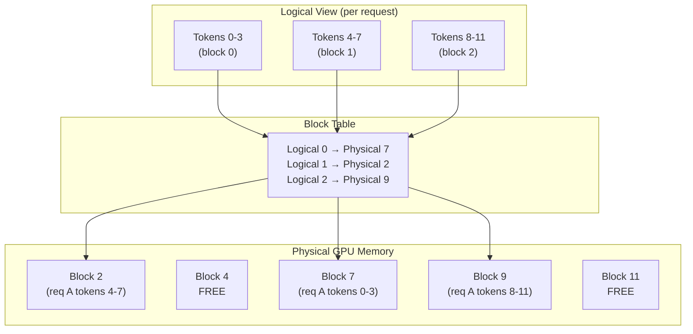
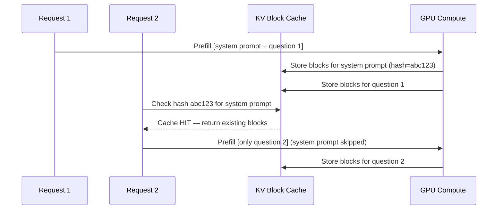
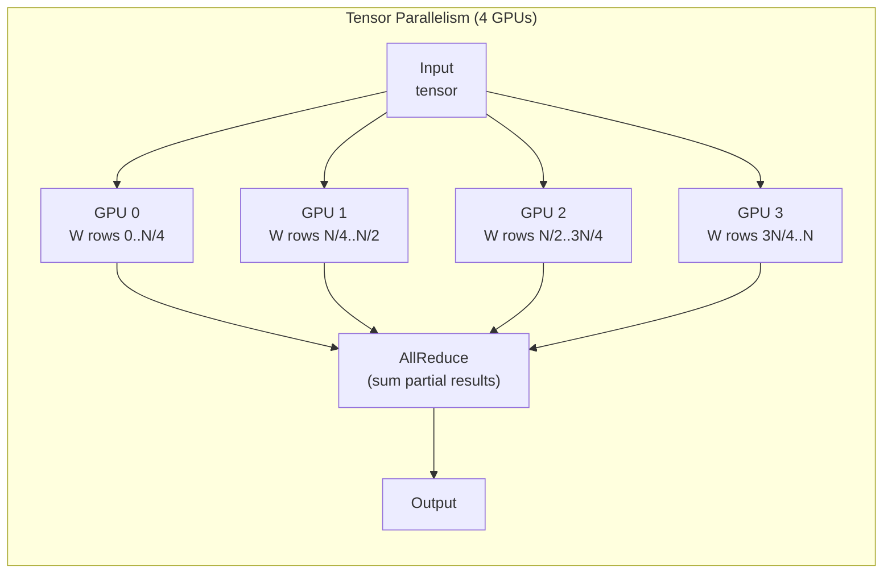
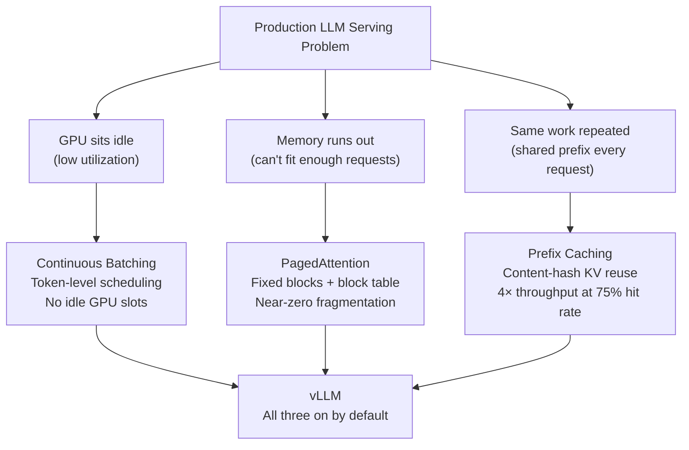

## The Problem: GPU Idle Time and Wasted Memory

The [previous post](/blog/llm-compression-quantization) covered how to shrink the model. This post covers what happens at runtime — how to serve it to many users at once without the GPU sitting idle or running out of memory.

To understand why these problems exist, start with the arithmetic of a single decode step.

During the decode phase (generating output tokens), each step performs a matrix multiply between a tiny input vector (the current token's embedding, shape `[1, d_model]`) and each weight matrix (shape `[d_model, d_model]`). The arithmetic intensity is approximately:

$$
\text{Arithmetic Intensity} = \frac{\text{FLOPs}}{\text{Bytes}} \approx \frac{2\, d_\text{model}^2}{d_\text{model}^2 \times \text{dtype\_bytes}} = \frac{2}{\text{dtype\_bytes}}
$$

For BF16 that's about **1 FLOP/byte** (counting a multiply-accumulate as 2 FLOPs). An H100 sustains ~989 TFLOPS of BF16 against 3.35 TB/s of memory bandwidth — it needs ~295 FLOPs of work per byte read to keep the Tensor Cores saturated. At ~1 FLOP/byte we're roughly **300× below that ratio**, so decode runs at a tiny fraction of peak compute.

The GPU is bottlenecked entirely on streaming weight tensors from HBM into SRAM — Tensor Cores sit mostly idle, waiting for data. Serving a single request at a time makes this situation worse: you pay the full cost of streaming every weight matrix, but you're only generating one user's token per pass instead of many.

<Callout label="The key insight">
Every decode step must read all model weights from HBM regardless of batch size. If you're generating for 1 user or 64 users simultaneously, the memory cost is nearly the same — but 64 users means 64× the useful work per byte read.
</Callout>

---

## Static Batching: Why It Works for CNNs but Fails for LLMs

The obvious fix is batching — process multiple requests in the same forward pass, amortizing the weight-loading cost across many users.

For traditional models (BERT classifiers, image models), **static batching** works well. You collect N requests, pad them to the same shape, run them together, and collect results. All N finish at roughly the same time because output size is fixed (one label, one embedding).

For LLMs, this assumption breaks completely:

```mermaid
gantt
    title Static Batching — GPU Slot Utilization
    dateFormat X
    axisFormat %s

    section Slot 1 (req A)
    Generating: 0, 8
    section Slot 2 (req B)
    Generating: 0, 3
    Idle waiting: 3, 8
    section Slot 3 (req C)
    Generating: 0, 5
    Idle waiting: 5, 8
    section Slot 4 (req D)
    Generating: 0, 8
```



Request B finishes at T=3, but its GPU slot sits idle until T=8 when the longest request (A or D) finishes. Every slot that finishes early becomes wasted capacity. At typical production traffic mix (some 5-token answers, some 2000-token essays), easily 40–60% of a static batch's lifetime is spent with some slots doing nothing.

---

## Continuous Batching: Token-Level Scheduling

Continuous batching (also called iteration-level scheduling) eliminates idle slots entirely by making one simple change: **instead of waiting for a batch to finish, the scheduler operates at every decode step**.

```mermaid
gantt
    title Continuous Batching — No Idle Slots
    dateFormat X
    axisFormat %s

    section Slot 1
    Request A: 0, 8
    section Slot 2
    Request B: 0, 3
    Request E (immediate): 3, 7
    section Slot 3
    Request C: 0, 5
    Request F (immediate): 5, 8
    section Slot 4
    Request D: 0, 8
```



The moment a request finishes, its slot is immediately reclaimed and the next waiting request begins. The GPU batch is never idle — it continuously cycles through requests as they complete.

The scheduler works like this at every decode step:



The prefill of a new request (processing its full input prompt in one shot) is interleaved into the batch. This is why vLLM reports both `num_requests_running` and `num_requests_waiting` — requests in the queue haven't started prefill yet.

---

## PagedAttention: OS Virtual Memory for the KV Cache

Continuous batching keeps the GPU busy. But fitting more requests into the batch requires managing the KV cache efficiently. Without this, memory fragmentation starves the scheduler.

### The Fragmentation Problem

Naive KV cache management pre-allocates a contiguous block of GPU memory per request, sized to the maximum possible output length:

```
GPU Memory (simplified)
┌──────────────────────────────────────────────────────────┐
│ Request A  [prompt KV][generated KV][   reserved   ][   ]│
│            ←──── 512 slots pre-allocated ─────────────→  │
│ gap [too small for anything]                              │
│ Request B  [prompt KV][generated KV][   reserved   ][   ]│
│            ←──── 512 slots pre-allocated ─────────────→  │
│ gap [too small for anything]                              │
│ [large free block — but unreachable due to fragmentation] │
└──────────────────────────────────────────────────────────┘
```

Three kinds of waste:
- **Internal fragmentation** — pre-allocated slots never used (request generates 100 tokens, 412 slots reserved but empty)
- **External fragmentation** — gaps between allocations too small for new requests
- **Pre-allocation waste** — slots reserved "for later" block requests that need memory now

The original vLLM paper reported that **only 20–40% of KV cache memory was storing real tokens** in naive implementations. The rest was waste.

### PagedAttention: Fixed-Size Blocks + Block Table

PagedAttention borrows virtual memory paging from OS design. Instead of one contiguous allocation per request, the KV cache is divided into fixed-size **pages** (blocks), each holding K and V tensors for a small number of tokens. A **block table** maps each request's logical token positions to the physical blocks holding them — blocks can be anywhere in memory.



Walking through a generation sequence:

```
Prompt "Artificial Intelligence is" arrives
→ allocate Block 3 (4 slots): store KV for tokens 0,1,2
→ Block table: [logical 0 → physical 3]

Generate token "the"
→ Block 3 has 1 slot left: fill it
→ Block table: [logical 0 → physical 3] (4/4 filled)

Generate token "future"
→ Block 3 is full: allocate Block 6
→ Store KV for "future" in Block 6
→ Block table: [logical 0 → physical 3, logical 1 → physical 6]
```

To compute attention for the current token, the model reads each block via the block table and performs block-wise attention — mathematically equivalent to contiguous attention since attention is computed as a weighted sum across all KV entries regardless of their physical location.

```python
# Simplified block-wise attention (conceptual)
def paged_attention(q_current, block_table, kv_blocks, block_size):
    all_k, all_v = [], []
    for logical_block_idx, physical_block_idx in enumerate(block_table):
        k_block, v_block = kv_blocks[physical_block_idx]  # fetch from GPU mem
        all_k.append(k_block)
        all_v.append(v_block)
    
    K = torch.cat(all_k, dim=0)   # shape [seq_len, head_dim]
    V = torch.cat(all_v, dim=0)
    
    scores = (q_current @ K.T) / K.shape[-1] ** 0.5
    weights = torch.softmax(scores, dim=-1)
    return weights @ V
```

**The result**: zero internal fragmentation (blocks allocated exactly as needed), zero external fragmentation (any free block fits any request), and no over-reservation. Memory utilization jumps from 20–40% to ~96%+, allowing significantly more concurrent requests.

### Block Size Tuning

vLLM's default block size is 16 tokens. Smaller blocks reduce waste for short sequences; larger blocks reduce block table overhead and improve memory locality for long ones.

```bash
# Adjust block size for your workload
vllm serve meta-llama/Llama-3.1-8B \
  --block-size 32  # default 16; try 8 for short-context, 32 for long-context
```

---

## Prefix Caching: Compute the System Prompt Once

Many production deployments send the same content at the start of every request: a system prompt, few-shot examples, or a RAG retrieved document. Without caching, each request recomputes KV entries for this shared prefix from scratch.

**Prefix caching** detects shared prefixes using content hashing and reuses their KV blocks.

### How It Works

When a request arrives, vLLM hashes the token IDs of each block-sized chunk of the prompt. If a hash matches a cached block, that block is reused — no prefill compute needed for those tokens.



Two patterns benefit most:

**Shared system prompt** — every user hits the same instructions. After the first request, the system prompt's KV blocks are cached and reused across all subsequent users.

**Multi-turn conversations** — turn N's prompt includes all of turn N-1. The blocks covering previous turns are already cached, so only new tokens need prefill.

```bash
# In vLLM's V1 engine (the default in recent releases) prefix caching is ON by
# default — it's automatic, based on hashing the token content of each block.
# On older versions, enable it explicitly:
vllm serve meta-llama/Llama-3.1-8B --enable-prefix-caching
```

The throughput impact is substantial. At 75% cache hit rate, throughput is roughly 4× higher because prefill (compute-intensive, takes the most time for long prompts) is skipped for cached blocks.

---

## vLLM in Practice

### Starting the Server

```bash
pip install vllm

# Basic serve
vllm serve meta-llama/Meta-Llama-3-8B

# Production-ready invocation
vllm serve meta-llama/Meta-Llama-3-8B \
  --dtype bfloat16 \
  --max-model-len 8192 \
  --gpu-memory-utilization 0.90 \
  --max-num-seqs 256 \
  --enable-prefix-caching \
  --port 8000
```

Key flags explained:

| Flag | What it does | When to tune |
|------|-------------|-------------|
| `--max-model-len` | Max context window (prompt + output) | Set to your actual max, not the model's theoretical max — unused length wastes KV pool |
| `--gpu-memory-utilization` | Fraction of GPU VRAM reserved for KV cache | Lower (0.80) if OOM during prefill; higher (0.95) to maximize concurrency |
| `--max-num-seqs` | Max concurrent sequences in the scheduler | Roughly equals peak concurrent users at low latency |
| `--tensor-parallel-size` | GPUs for tensor parallelism | Required for 70B+ models; set to number of GPUs on one node |
| `--pipeline-parallel-size` | Pipeline stages across nodes | For multi-node deployments of very large models |
| `--enable-chunked-prefill` | Split long prefills across steps | Prevents long prompts from stalling the decode queue |

### Serving a Quantized Model

vLLM auto-detects the quantization scheme from the model's config (LLM Compressor writes it into `config.json` in compressed-tensors format):

```bash
# Serve a GPTQ W4A16 model
vllm serve ./llama3-8b-w4a16-gptq \
  --dtype auto \        # auto reads from quantize_config.json
  --max-model-len 4096

# Serve a FP8 model (H100 required)
vllm serve ./llama3-70b-fp8 \
  --dtype auto \
  --tensor-parallel-size 2
```

### OpenAI-Compatible API

vLLM implements the same HTTP routes as OpenAI's API. Zero application code changes needed to switch from hosted to self-hosted:

```python
from openai import OpenAI

# Same client, different base_url
client = OpenAI(
    base_url="http://localhost:8000/v1",
    api_key="unused",  # vLLM doesn't require auth by default
)

response = client.chat.completions.create(
    model="meta-llama/Meta-Llama-3-8B",  # must match --served-model-name
    messages=[
        {"role": "system", "content": "You are a helpful assistant."},
        {"role": "user", "content": "Explain PagedAttention in one paragraph."},
    ],
    max_tokens=200,
    temperature=0.7,
)
print(response.choices[0].message.content)
print(f"Tokens used: {response.usage.total_tokens}")
```

### Logprobs: Inspecting Model Confidence

vLLM's API exposes token-level log probabilities — the model's raw confidence scores before any sampling. This is critical for building reliable production systems:

```python
response = client.chat.completions.create(
    model=MODEL,
    messages=[{"role": "user", "content": "The capital of France is"}],
    max_tokens=5,
    temperature=0.0,
    logprobs=True,
    top_logprobs=5,  # return top 5 alternatives per token
)

for token_info in response.choices[0].logprobs.content:
    chosen_prob = math.exp(token_info.logprob) * 100
    print(f"Chosen: '{token_info.token}' ({chosen_prob:.1f}% confidence)")
    print("  Alternatives:")
    for alt in token_info.top_logprobs:
        alt_prob = math.exp(alt.logprob) * 100
        print(f"    '{alt.token}': {alt_prob:.1f}%")
```

```
Chosen: ' Paris' (92.5% confidence)
  Alternatives:
    ' Paris': 92.5%
    ' Lyon': 3.1%
    ' the': 2.8%
    ' France': 0.9%
    ' a': 0.7%
```

**Where logprobs matter in production:**
- **Hallucination detection** — low-confidence tokens at key factual positions are a signal to flag for review
- **Routing** — route low-confidence responses to a larger model
- **Calibration** — build confidence thresholds for classification tasks
- **RAG quality** — if the model is uncertain at the answer, the retrieved context may not be relevant

---

## Observability: The /metrics Endpoint

vLLM exposes a Prometheus-compatible `/metrics` endpoint. Scrape it with Prometheus + Grafana, or poll it directly in code.

```python
import requests, math

def get_vllm_metrics(base_url="http://localhost:8000"):
    r = requests.get(f"{base_url}/metrics")
    metrics = {}
    for line in r.text.split("\n"):
        if line.startswith("#") or not line.strip():
            continue
        name = line.split("{")[0].split()[0]
        try:
            metrics[name] = float(line.split()[-1])
        except (ValueError, IndexError):
            continue
    return metrics

def print_key_metrics(metrics):
    keys = {
        "vllm:num_requests_running": "Active requests",
        "vllm:num_requests_waiting": "Queued requests",
        "vllm:gpu_cache_usage_perc": "KV cache usage %",
        "vllm:prompt_tokens_total": "Total prompt tokens",
        "vllm:generation_tokens_total": "Total output tokens",
        "vllm:prefix_cache_queries_total": "Prefix cache queries",
        "vllm:prefix_cache_hits_total": "Prefix cache hits",
    }
    for key, label in keys.items():
        if key in metrics:
            print(f"  {label}: {metrics[key]:g}")

metrics = get_vllm_metrics()
print_key_metrics(metrics)
```

### Key Metrics and What to Alert On

| Metric | Alert Condition | Meaning |
|--------|----------------|---------|
| `num_requests_waiting` | > 0 sustained | Scheduler can't keep up — add throughput or reduce max_num_seqs |
| `gpu_cache_usage_perc` | > 90% | KV cache near-full — increase GPU count or reduce max-model-len |
| `num_requests_running` | Drops to 0 with waiting > 0 | Scheduler stall — possible OOM or preemption loop |
| `e2e_request_latency` P99 | > SLO | End-to-end latency SLA breach |
| `time_to_first_token` P95 | > SLO | Prefill bottleneck — consider chunked prefill |

### Watching Continuous Batching Live

```python
import concurrent.futures, time, threading

def ask(prompt, client, model):
    return client.chat.completions.create(
        model=model,
        messages=[{"role": "user", "content": prompt}],
        max_tokens=100,
        temperature=0.7,
    )

prompts = [
    "Explain transformer attention.",
    "What is CUDA?",
    "Summarize the history of deep learning.",
    "How does backpropagation work?",
    "What is gradient descent?",
]

snapshots = []
stop_flag = threading.Event()

def poll_metrics():
    while not stop_flag.is_set():
        m = get_vllm_metrics()
        snapshots.append({
            "time": time.time(),
            "running": m.get("vllm:num_requests_running", 0),
            "waiting": m.get("vllm:num_requests_waiting", 0),
            "kv_cache_pct": m.get("vllm:gpu_cache_usage_perc", 0),
        })
        time.sleep(0.2)

monitor = threading.Thread(target=poll_metrics, daemon=True)
monitor.start()

start = time.time()
with concurrent.futures.ThreadPoolExecutor(max_workers=len(prompts)) as pool:
    futures = [pool.submit(ask, p, client, MODEL) for p in prompts]
    concurrent.futures.wait(futures)
stop_flag.set()

print(f"All done in {time.time() - start:.2f}s")
for snap in snapshots:
    print(f"  t={snap['time'] - start:.1f}s  running={snap['running']}  waiting={snap['waiting']}  kv={snap['kv_cache_pct']:.0%}")
```

You'll see `running` spike to 5 immediately (all requests batched together), then decay as each finishes — exactly continuous batching at work.

---

## Beyond the Course: Advanced vLLM Features

### Chunked Prefill

A problem with mixing long-prompt requests into continuous batching: a single long prefill (say, 32K tokens) can dominate an entire decode step, blocking other requests from generating tokens and causing TTFT spikes.

**Chunked prefill** splits a long prefill across multiple decode steps, interleaving it with ongoing decode work:

```bash
vllm serve meta-llama/Meta-Llama-3-70B \
  --enable-chunked-prefill \
  --max-num-batched-tokens 4096  # max tokens processed per step across all requests
```

The scheduler fills each step up to `max-num-batched-tokens` with a mix of prefill chunks and decode tokens. Long prompts don't stall the queue — they get processed incrementally while existing requests keep generating.

### Tensor Parallelism

For models that don't fit on one GPU, tensor parallelism shards each weight matrix across multiple GPUs. Each GPU holds a slice of every matrix and communicates with AllReduce after each matrix multiply:

```bash
# Llama 3 70B: needs at least 2×80GB GPUs at BF16, 1×80GB at FP8
vllm serve meta-llama/Meta-Llama-3-70B \
  --tensor-parallel-size 4 \  # 4 GPUs on one node
  --dtype bfloat16
```



For multi-node serving (e.g., Llama 3 405B), combine tensor and pipeline parallelism:

```bash
# 2 nodes × 8 GPUs = 16 GPUs total
vllm serve meta-llama/Meta-Llama-3-405B \
  --tensor-parallel-size 8 \    # within each node
  --pipeline-parallel-size 2 \  # across nodes
  --dtype bfloat16
```

### Speculative Decoding

Decode is memory-bandwidth-bound because a single token is generated per step — Tensor Cores are under-utilized. Speculative decoding uses a small **draft model** to generate several tokens speculatively, then verifies them in parallel with the large model:

```bash
# Current vLLM uses a single --speculative-config JSON blob:
vllm serve meta-llama/Meta-Llama-3-70B \
  --speculative-config '{"model": "meta-llama/Meta-Llama-3-8B", "num_speculative_tokens": 5}'
# (older vLLM used the separate --speculative-model / --num-speculative-tokens flags)
```

The large model verifies all 5 speculative tokens in one forward pass (parallel, using the full batch of speculative inputs). Accepted tokens are kept; rejected tokens cause a rollback to the last accepted position. On tasks where the small model agrees with the large model often (which is task-dependent), this can achieve 2–3× speedup with identical output distribution.

### Multi-LoRA Serving

Fine-tuned LoRA adapters can be served alongside a base model without maintaining separate model replicas. vLLM swaps LoRA weights per-request:

```python
from vllm import LLM, SamplingParams
from vllm.lora.request import LoRARequest

llm = LLM(
    model="meta-llama/Meta-Llama-3-8B",
    enable_lora=True,
    max_loras=4,           # how many LoRA adapters to keep loaded
    max_lora_rank=64,
)

# Route different users to different adapters
output = llm.generate(
    "Translate to French: Hello world",
    SamplingParams(max_tokens=50),
    lora_request=LoRARequest("french-adapter", 1, "./loras/french"),
)
```

---

## Production Deployment Patterns

### Docker

```dockerfile
FROM vllm/vllm-openai:latest

ENV HF_HOME=/model-cache

CMD ["vllm", "serve", "meta-llama/Meta-Llama-3-8B", \
     "--dtype", "bfloat16", \
     "--max-model-len", "8192", \
     "--gpu-memory-utilization", "0.90", \
     "--enable-prefix-caching", \
     "--port", "8000"]
```

```bash
docker run --gpus all \
  -v /data/hf-cache:/model-cache \
  -p 8000:8000 \
  my-vllm-server
```

### Health Checks

vLLM exposes two health endpoints:

```bash
# Startup probe — model loaded and ready
curl http://localhost:8000/health

# Readiness probe — model serving requests
curl http://localhost:8000/v1/models
```

In Kubernetes:

```yaml
livenessProbe:
  httpGet:
    path: /health
    port: 8000
  initialDelaySeconds: 120  # allow model to load
  periodSeconds: 10

readinessProbe:
  httpGet:
    path: /v1/models
    port: 8000
  initialDelaySeconds: 120
  periodSeconds: 5
```

### Auto-Scaling Signal

Scale on `num_requests_waiting > 0` sustained for > 30 seconds — that's the signal that your current fleet can't absorb incoming load. GPU cache usage > 85% is a leading indicator (the scheduler will start preempting requests soon).

---

## Putting It Together: The Three Levers



These three techniques are complementary:
- **Continuous batching** maximizes GPU compute utilization
- **PagedAttention** maximizes how many requests fit in the KV pool at once
- **Prefix caching** minimizes the compute needed per request when prompts overlap

None of them require any model changes — they're pure serving-layer optimizations on top of whatever model (quantized or not) you're running.

The next post covers how to measure whether all of this is actually working: benchmarking with GuideLLM and evaluation with lm-evaluation-harness.

---

*Based on DeepLearning.AI's [Fast & Efficient LLM Inference with vLLM](https://www.deeplearning.ai/courses/fast-and-efficient-llm-inference-with-vllm) course (Red Hat, taught by Cedric Clyburn); course material credit to DeepLearning.AI and Red Hat. [vLLM](https://github.com/vllm-project/vllm) is maintained by the vLLM project and Red Hat.*

*Written by Vatsal Thakkar*
